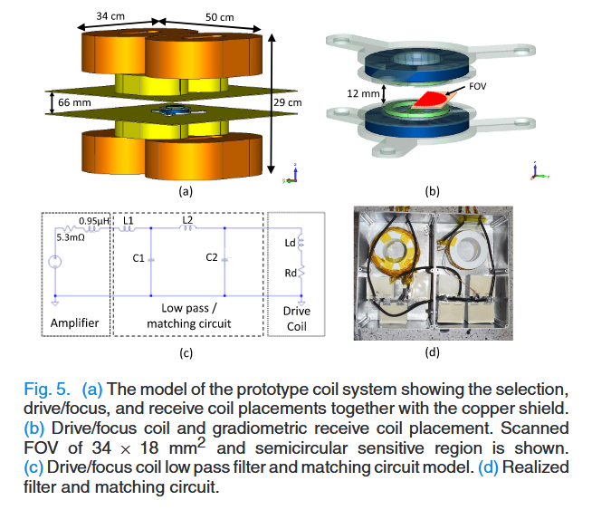

 Paper Name | Year | Publication Venue | Author(1st & Corr.) | Short Summary | Item Number | 
|------|------|------|------|------|------|
| Tomographic imaging using the nonlinear response of magnetic particles | 2005 | Nature | Bernhard Gleich, Jurgen Weizenecker | MPI开山之作，富有远见的预估了MPI的成像性能，提出了MPI的两种成像模式，针对重建问题也设置了对应的求解方法 | 2005.1 | 
| Analysis of a 3-D System Function Measured for Magnetic Particle Imaging | 2012 | TMI | Jürgen Rahmer | 从时域和频域的两个角度分析了系统函数的一些性质，比如混合因子、时域空间形状、高低频信噪比等 | 2012.1 |

* **#2005.1**  
  文章开篇提及MRI等影像模态的造影剂(or示踪剂or tracer颗粒)在诊断和治疗中起到关键作用，但造影剂的使用受限于其检测阈值，在一般的成像模态中组织的背景信号会对示踪剂信号造成很大的影响，因此提出通过粒子弛豫的效应直接检测(这里其实还是更侧重在MRI中运用弛豫机制作为MRI中组织的造影剂)，但弛豫检测粒子的方法也有一定的问题，即将信号转换为空间上的一张图像的成像逆问题是严重病态的。文章提出了使用小型磁纳米颗粒的非线性磁化来进行高分辨率成像的方法，并设计了初步的装置和实验验证了MPI成像的可行性，同时评估了该方法的改进前景，说明了MPI有潜力发展成为兼具高空间分辨率和高灵敏度的成像方法。
  
  在这篇开山之作中，作者就提出了MPI的两种成像方式：首先是**调制场**的概念，调制场类似后续时变的驱动场，在**梯度场**的叠加下只在特定的FFP位置产生信号，于是每次只需要移动FFP位置或者是通过机械装置移动扫描物品，这样的成像方式是无需进行重建的，因为一次只会采集特定位置的信号(后续将其称为MPS扫描方式)，但存在诸多的问题，首先如果通过机械装置移动扫描时间很长，并且因为调制场需要满足幅值较小的条件(**必须幅值小才能保证在FFP之外的粒子不管调制场怎么变都不会进入磁化曲线的动态区域**)，因此导致采集信号信噪比极低，因此萌生第二种成像方案，也是我们熟知的MPI成像；三维情况下引入三个正交的**驱动场**，通过预定义的电流驱动这三个线圈对，FFP可以在物体中以任意连续轨迹移动，驱动场无需满足赋值小的前提，因为此时即使单个时间会有多个位置的粒子产生信号，我们仅需记录单位浓度的粒子响应情况，建立系统函数计算成像逆问题，同样可以求得每个位置的浓度信息，甚至驱动电流一定要够大，才能抵消梯度场边缘梯度磁场极大的情况，总之，**驱动场的引入即可解决低SNR和低空间编码速度的问题**。
   
  在作者的设想中，这两种成像方式应该结合在一起，他在实验中也是这么设计的：使用相同的Phantom进行成像，**第一组**仅使用机械装置调整扫描物体，但使用驱动场产生信号(驱动场仍然会在垂直方向移动比较大的距离，但我们选择使用系统矩阵成像，因此也无所谓)，因为进行重建所以不考虑调制场；**第二组**利用了驱动场本身会在垂直方向移动的特性，机械装置负责水平的空间位置编码，驱动场负责垂直方向的FFP移动，但第二组实验的机械装置位置仅是第一组实验的子集，第二组实验中垂直方向只有三个机械装置位置，这意味着驱动场的场强不足以覆盖整个FOV的高度，因此选择的方案是单独重建三个位置的粒子浓度，分别覆盖上中下，最后在三个图像中取平均，如下图(这里的机械装置位置理解成不同的FFP位置)：
   
  
  
  作者用了很大的篇幅去分析MPI成像的指标和其可行性，文章中将MPI的空间分辨率定义为
  $2\frac{H_k}{X_s}$ ，其中
  $H_k$ 代表材料产生谐波信号的磁场强度，
  $X_s$ 代表梯度场场强，这个分析在现在看来是不充分的，其实分析的就是MPS测量模式下的朗之万曲线的分辨能力，文章中根据30nm粒子的饱和强度计算了空间分辨率，得到了可以将MPI成像分辨率提升到亚毫米级的结论；文章中还根据朗之万曲线计算了10-40nm的谐波信号强度，因为在能获得多个频率下的基础噪声强度的情况下，评估谐波信号强度其实也是在查看各个粒子直径下的SNR情况，有几个很好的现象，Resovist造影剂得到的谐波信号强度与30nm3%铁离子浓度(与Resovist相比)的走向相似，也就是说，MPI的成像灵敏度有很大的优势，同时，因为40nm的信号强度大概是Resovist的两个数量级，因此有理由相信，**改进MPI的硬件设备和tracer本身的质量**很有可能能进一步提高粒子的灵敏度。文章还分析了编码速度和对人体的伤害，提出了引入类似focus field的概念进一步扩大成像范围，最后的结论是MPI具有极强的潜力。
  
  作者初步说明了MPI具有高分辨率、高灵敏度、不衰减穿透组织的优点，同时提到了医学成像、裂缝检测、局部加热等可能的应用场景。
  
  实验和成像方法：FOV大小为9.4mm * 9.4mm，共计52*52个像素点，重建范式中同时用到了**多个装置位置的测量信号和参考响应信号**，重建的正问题方程仍然是系统矩阵和粒子浓度的矩阵乘法计算，不同之处就是多个机械装置位置分开，会产生多组频域信号，但系统矩阵是共用的(不管有多少个机械装置位置，都可以看成是一次扫描的周期)，可以通过参考响应信号一次获得；系统矩阵是通过较大的sample测量得到的，因此作者在求解单位响应的时候做了一个傅里叶变换，卷积操作就直接变成了乘积，作者通过频域响应信号除以粒子浓度得到频域系统函数，再进行逆傅里叶变换得到系统函数。因为机械装置位置的不同和频率的不同，相当于电压信号是有两个维度的，这篇文章的解决方法是将单一频率的信号放在一起，即不同位置的信号构成一个测量信号向量，通过求解逆矩阵获得粒子信号，每个频率都会获得一个对应信号，再在多个频率中取平均；而在第二种情况中，机械装置位置减少，系统矩阵的定义也发生改变，单次计算出的粒子浓度信号只有[1*52]，这样单次的系统矩阵变成了[可信赖的频率范围*52]，垂直方向有3个机械装置位置，因此单个垂直线的浓度由三个图像平均得到。

* **#2012.1**  
  开始找到这篇文章的初衷是'Online reconstruction of 3D magnetic particle imaging data(2016年的实时重建框架)'，文章中提到了系统矩阵单行(单一频率)下的SNR阈值帮助筛选重建需要的系统矩阵行，这一做法最早是从Rahmer的这篇2012TMI出来的。
  
  文章开头提到3D系统函数的特征是决定空间成像和spatial encooding process的关键，因此从时域和频域两个角度对系统函数做了一个比较全面的分析。
  
  Introduction中提到了一些和本文无关但比较重要的内容：首先MPI可以在无需考虑重建问题的情况下得到图像(这是Rahmer组自己的说法)，其实就是要么采用2005年Science中的方法，使用较小的调制场配合梯度场，只有极小范围的粒子产生信号，其实也就是MPS的成像模式(之所以使用系统矩阵就是单一时刻有多处粒子产生信号需要通过系统矩阵进行定量)；要么就是Goodwill组基于X-Space的方法，Rahmer组认为这类方法其实就是通过时域信号对应到具体的FFP位置的粒子浓度，但同时Rahmer组提到了**X-Space目前只适用于线性的FFP轨迹，单向笛卡尔轨迹需要通过机械装置或聚焦场进行位置调整，因此X-Space方法虽然成像速度快，但总的来说完全不符合即时成像的要求**，Rahmer还认为**反卷积的方法无法直接推广到2D和3D场景**；**对于快速成像，成像轨迹需要满足快速致密的特性，因此Rahmer推荐使用丽萨荣轨迹，但丽萨荣轨迹下的信号无法得到精确的图像数学变换公式，因此只能妥协于系统矩阵的方式建立测量信号和粒子浓度之间的关系，同时系统矩阵的建立可以在时域中进行，时域SF保持了与FFP空间位置的链接，也可以在频域中进行，频域SF能提供其他有用的信息且反映频谱过滤的影响**
  
  
  
  上述为丽萨荣轨迹下的MPI扫描使用到的扫描设备，z方向上的永磁体和线圈提供三个维度上的梯度场(只需要一个方向的maxwell coils就可以提供该方向上更大且三个方向上都有的梯度场)，同时z方向上的梯度场线圈也充当了z方向上的驱动场线圈，堆栈式的绿色线圈表示其他方向上的驱动场，由于设备本身是孔径插入待测样本，所以在x方向上使用筒形的线圈，图像中蓝色的是接收线圈，排布和驱动场线圈类似。
     
  设置的丽萨荣轨迹的单个驱动场频率大约是25kHz，具体为
  $f_x / f_y / f_z = 24.51 / 26.04 / 25.25kHz$,根据公因子计算最小循环周期为
  $T_R = 21.54ms$，同时根据文中给出的梯度场梯度可以计算出FFP的运动范围为
  $13.1 * 13.1 * 6.5 mm^3$，信号采集频率为20MS/s，在10帧之间做平均即可得到真实的信号采集频率为2MS/s，有了上述的一些具体硬件参数，我们可以考虑重建问题如下：
  
  $$
  minimize  ||\mathbf{W}(\mathbf{Gc}-\mathbf{v})||^2 + \lambda ||\mathbf{c}||^2
  $$
  
  上述公式中，很重要的一个点就在于如何表示SF矩阵，在基于物理模型的方法无法正确描述磁化现象的前提下，显然用校准测量得到的系统矩阵更精准，需要注意的是，在系统矩阵的测量过程中，测量范围通常需要大于FFP实际的轨迹范围，因为实际FFP不是一个点，磁化的影响要超过FFP覆盖的范围，文中实际的网格大小为
  $28*34*20=19040$，采样点为
  $3*43084=129252$，但在这篇文章中为了定性去分析一些现象，选择拆分三个频道的信号各自构建系统矩阵，在这样的实验条件下，频域的基频由循环周期确定，最高的频率可以到2MHz，同时文章在这里引入了 **混合阶数，即三个混合因子的绝对值之和**的概念，即：  
  $$$
   \mathcal{f} = | \mathcal{n_x} \mathcal{f_x} + \mathcal{n_y} \mathcal{f_y} + \mathcal{n_z} \mathcal{f_z} |
  $$$

  仿真实验中，使用比奥萨法尔定律尽量模拟类似实验情况的磁场数据，同时忽略了弛豫效应和各向异性，仿真中包含一个与真实噪声水平匹配的高斯白噪声。

  **对实验和仿真的系统函数的分析是本文的重点**，主要围绕文章中的几张图展开：首先分析时域系统矩阵，时域系统矩阵如果在三维中表示出来可以认为是梯度场对于信号的定位效果，一个很明显的观察是信号响应位于FFP的速度矢量的侧面，且延伸到FOV相当大的一块区域之内，如图：

  

  从实验结果来讲，能从时域系统矩阵的包络中得到的信息相当有限，转战频域：

  

  这张实验图有很多的内容，(a)主要分析了按照基频作为1倍的单位，一直到采样最高频率的各频率混合阶数的大小，混合阶数越来越大的同时频率分量也在越来越大，高混合阶数的情况下，峰宽变大，导致多种混合阶数出现重叠，一些较大的频率分量出现多种混合阶数的情况，(b)(c)分析了x和z频道中的SNR大小，基本可以看的出来走势和混合阶数类似，(d)(e)(f)是选定混合阶数为9和混合阶数为32的峰值部分的放大情况，(h)(i)(j)则进一步将上述的信号放大观察，这两个放大的操作都以混合阶数、x和z频道上的SNR展开，这里提到了最开始来看这篇文章的初衷，即**这里的各频率分量的SNR是如何计算得到的，其实就是将粒子信号的范数和空腔信号的范数做了一个比值作为了SNR**，在最精细的(i)(j)中，观察到的SNR峰值基本走势也和放大后的混合阶数走势相符，这在很大程度上说明在较高的频率范围内，较低混合阶数的频率分量贡献了较高的信号；但在32的混合阶数中，总的混合阶数貌似在小范围内变化不大，但SNR也出现了一个明显的峰值，作者分析认为这需要通过(g)的右侧对三个频道的混合因子分离才能得出结论，即在混合阶数大致相同的情况下，三个混合因子比较接近，没有哪个非常大的情况下SNR也会有所提升，这同样说明光靠混合阶数来判断SNR是否出现峰值是不可靠的。

  对整体的混合阶数和SNR做分析之后，可以对具体的单一频率的spatial pattern(即三维的形状包络)做一点分析，基本的一个现象是低混合阶数的形状更粗糙，高混合阶数的形状更精细：

  

  图片展示中同时对比的两栏分别是在30nm直径下的仿真系统函数展示和通过观察较为粗糙的系统矩阵的极值个数来确定的第二类切比雪夫多项式的垂直乘积(这个不是一个普适结论貌似)，第二类切比雪夫多项式和单频率系统矩阵的关系在Rahmer的那篇分析系统函数的工作也有讲到，可以预见的是在卷积核的卷积作用下一定会和第二类切比雪夫多项式出现一定的差异，但又有一定的相似性，同时在那篇文章中，实际上2D和3D的情况下卷积形式是没有通过精确的卷积公式表达的，因此这是利用第二类切比雪夫多项式解决系统函数问题的一个遗憾。

  此外，在混合因子的绝对值相等的前提下，由仿真和第二类切比雪夫多项式得到的结果都具有高度的相似性，甚至可以说只有正负符号上的差别，但其实在真实实验数据下这个现象并不是很明显，这说明朗之万去拟合磁化特性是远远不够的：

  

  此外，由于磁化曲线卷积核的影响，实际的频谱信号会出现一定的扭曲，因为粒子直径直接决定了磁化曲线求导的峰值宽度，因此可以分析不同粒子直径对于频谱信号的影响：对于更大直径的粒子，是能提供更高频的可用信号的；同时在特定的频段，侧脸得到的SF包络可以和特定直径和铁离子浓度的仿真互相匹配，所以得到了这篇文章的最后一张实验结果图：

  

  **实验过后的结论分析和总结**(观点按照分号进行区分)：时域系统函数的可视化说明MPI不是单纯的点响应成像方法，反而可以编码比较大的一块区域，这可能允许一些密度较低但更快的FFP扫描轨迹出现；上面的一个实验中分析得到，当混合因子的绝对值相等时，理想的系统函数形状只会出现符号上的区别，因此单通道SF中只有约25%的分量代表独立的spatial pattern；如果将单频率的系统函数看成是MPI重建过程中的一组基函数，那么单个基函数在不同FOV区域的空间频率上的影响是不同的，同时卷积核对系统函数的影响首先出现在高频分量的图案边缘的精细空间结构上；即便在真实的实验场景下通过高通滤波去除了很多靠近基频的信号，但其实也只有混合阶数为1、2、3的共计31种不同的频率组合方式受到影响罢了(只有在混合阶数比较低的情况下SNR才高，信号才真正具有实际影响)，这些低混合阶数的情况因为对应的空间频率也很低，完全可以通过重建公式中的正则化加以引导改进，同时，改进的硬件装置也可能在未来将受影响的高SNR频率分量控制在混合阶数仅为1的三种情况中；系统能达到的最小分辨率可以由不被噪声淹没的处在混合阶数最小峰值的频率分量的spatial pattern决定，同时测量SF中的绝大多数可用信号都在较低的频率分量中，这导致信号中缺乏空间高频信息，因为受到卷积核的影响高混合阶数对应的高频分量受到扭曲，真实粒子都是有一个直径分布的(对数高斯分布)，因此实际上只要有大直径的粒子，都会对高频分量的细节保留有所帮助；如果MPI希望达到亚毫米级别的分辨率，则在一些对应的频率分量中必须提供足够的SNR，且在一些真实的实验场景中我们不得不拿一定的空间分辨率换取足够的SNR；文章中提到了使用MPS的设备模拟在MPI设备中的特定位置，此时可以在MPS设备中使用更大的校准测量样本，这样能获得更大的SNR值；在重建过程中，可以使用加权的方式来选择频率分量和赋予某些具有精细空间模式的频率更多权重，同时实验中展示的真实系统函数形状不满足25%相似性这一点，充分说明了当前基于模型的系统矩阵构建还不够完善(朗之万曲线、粒子各向异性、粒子弛豫等等)。

  回答最后看这篇文章的初衷，计算SNR的方式，即对粒子信号和空间信号做比值，下面的公式中其实就是单个频率下各个空间位置的平方和根：

  

  
  
  
  
  

  
  

  
  
