| Paper Name | Year | Publication Venue | Author(1st & Corr.) | Short Summary | Item Number | 
|------|------|------|------|------|------|
| Field-free line formation in a magnetic field | 2010 | JOURNAL OF PHYSICS A: MATHEMATICAL AND THEORETICAL | T Knopp，T M Buzug | 07年Jurgen组FFL线圈拓扑的改进 | 2010.1 | 
| Experimental generation of an arbitrarily rotated field-free line for the use in magnetic particle imaging | 2011 | Medical physics | Marlitt Erbe, Thorsten M. Buzug | FFL线圈拓扑的进一步优化 | 2011.1 | 

* **2010.1**    
  这篇文章可以看成是07年Jurgen组"Magnetic particle imaging using a field free line"这篇最早使用FFL的线圈拓扑的改进版本，那篇文章的32个线圈组成梯度场难以实现，需要在减少功率消耗和具体实现难度的基础上实现对FFL的平移+旋转。

  **本文的主要工作就是完成了对FFL线圈对的简化并给出了相对严格的证明，并且在仿真实验中仿真了不同线圈对的功耗表现和生成磁场表现**，本文最终的结论是**只需要三组以上的Maxwell线圈对就可以完成对FFL梯度场的构建，同时在这样的拓扑设计下，FFL的线圈对功率消耗不会显著大于基于FFP的线圈拓扑**。

  **理论部分**：这部分总共会出现三组坐标系，分别是世界坐标系、FFL坐标系和线圈坐标系，世界坐标即下图的
  $\gamma$，FFL坐标系就是在当前的FFL处于一个
  $\beta$角度时，会出现一个下图的
  $\gamma^{\beta}$坐标，线圈坐标就是在多组以不同角度摆放的线圈的方向为基准定义的一个坐标系下的坐标，三种坐标之间可以进行线性的转换，下面这个图中的结论如果是坐标的话是错误的，如果是坐标系才是正确的，因此这里的坐标转换的转换矩阵搞反了，请注意区别，但文章中经验证最终的结论是正确的：

  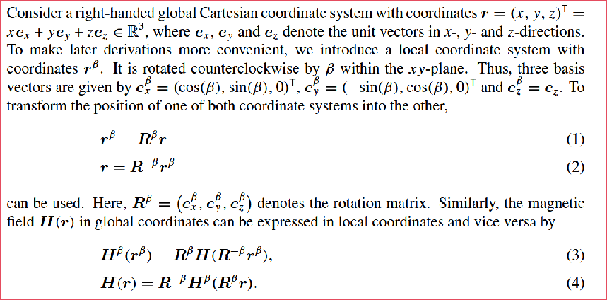

  还有一点，上图中的坐标不需要对应到具体哪个是哪个坐标系，因为后续的推导只需要用到坐标之间的转换，具体看后续的推导中的表达就行了。

  先考虑旋转的问题，思考如下：

  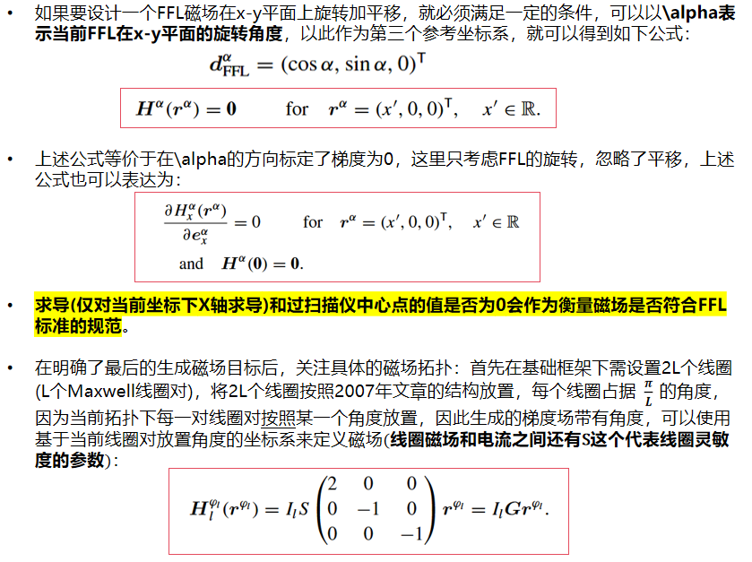
  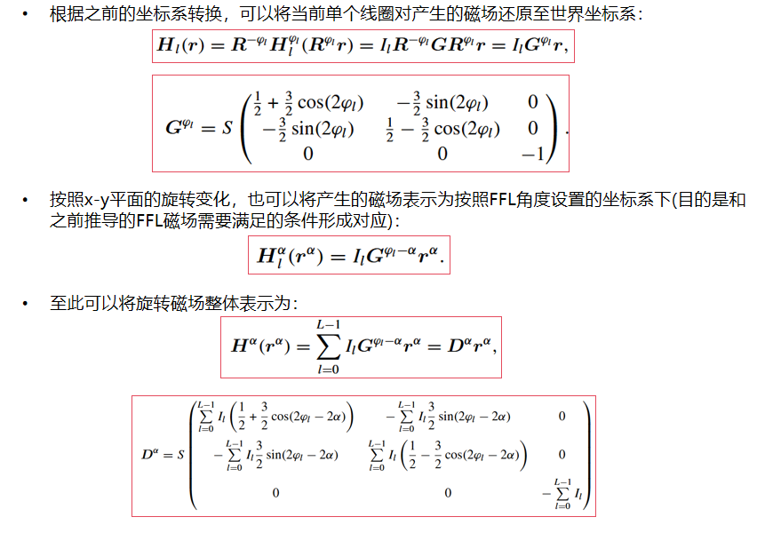
  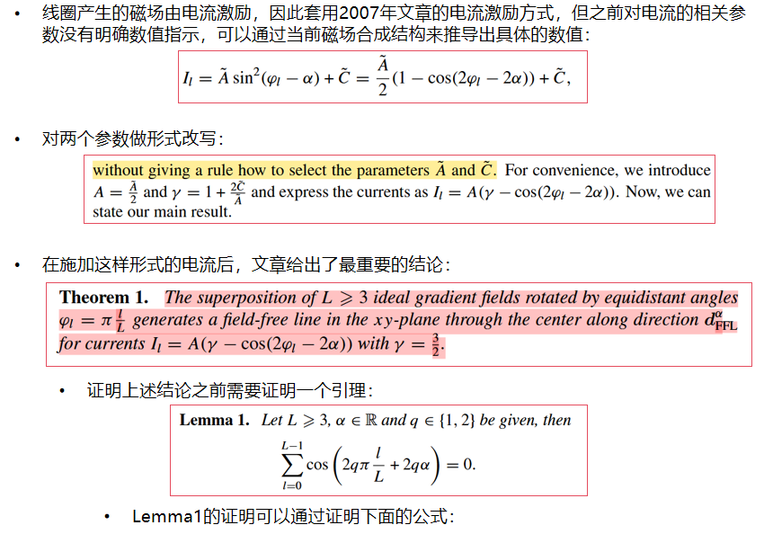
  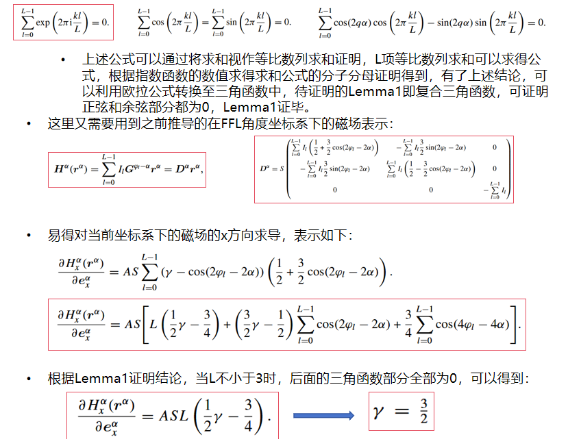
  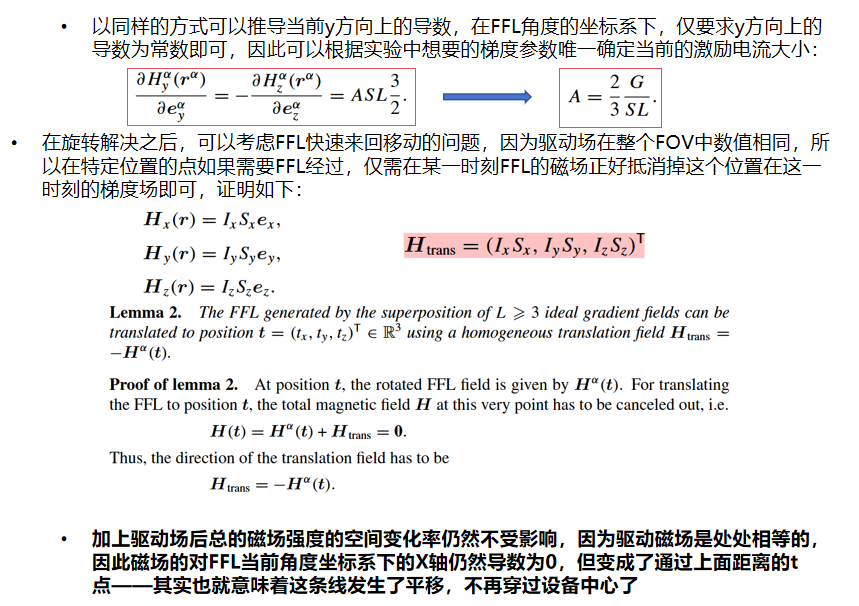

  **结论分析**：并不是线圈对越多越好产生磁场的效果越好；FFL需要多组线圈对，线圈对越多必然功耗越高，与产生同级别磁场强度的FFP线圈拓扑的功耗相比，FFL的功耗略大但还是处于同一能级；对于二维成像，综合线圈能力和功耗，完全可以选择3-4组线圈对就能构成梯度场，驱动场还是需要两个方向上的亥姆霍兹线圈对。

* **#2011.1**  
  以Goodwill组的视角，因为他们在X-Space的基础上创建了投影成像这样一种成像的方式，因此他们很自然的将一些成像二维平面+调整第三个维度+拼接的三维成像方式称为断层成像，这篇文章的重点在于**在之前旋转+平移的多组线圈对拓扑基础上进一步改进，不涉及重建的内容**。

  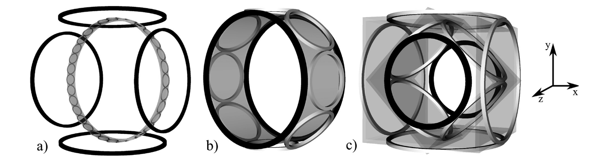

  上图基本说明了这篇文章的一个改进思路，图(a)就是Jurgen组的最早FFL线圈拓扑的示意图，图(b)和图(c)都是在这篇文章中进行改进的方式。Knopp组#2010.1的文章最大的问题还是能耗，虽然跟基于FFP的扫描仪大致处于同一能级，但还是在传统FFP扫描仪能耗的7倍左右，因此引入图(b)的改进方式，这里借助一个图进一步阐述图(b)的改进思路：

  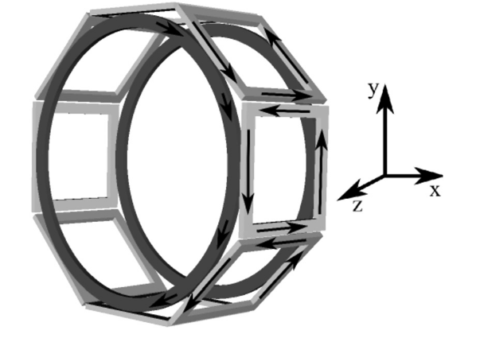

  上图其实是将圆形线圈改为了矩阵线圈(这样改是为了凸显静态电流的流经方向)，目的就是说明一些静态电流的现象：相邻线圈的彼此面对的部分的静态电流具有相反的方向，因此可以互相抵消(这个结论建立在每个线圈的电流虽然不同，但静态电流是相同的，静态电流的部分只跟当前FFL的角度相关的基础上)，这些电流是多余的，会造成功率损失，但不会对产生的磁场有任何影响，因此静态电流的两个在x-y平面上的反向电流环完全可以采用布置在z方向的一对线圈替代，动态的电流无法抵消，因此还是需要原来的线圈对提供。

  接下来的分析分为三个部分，首先是**线圈产生FFP需要的梯度场**，其核心是**在x和y方向布置的两组线圈对足以生成三个正交的FFP梯度场**：

  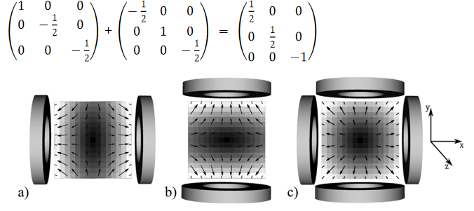

  其次是**线圈产生FFL需要的梯度场**，其核心是**三个方向上的FFL梯度场都可以由两个正交的线圈对生成**：

  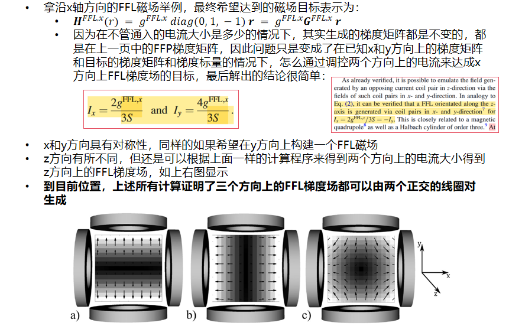

  之后是**线圈产生FFL旋转需要的磁场**，其核心是**常规的FFL线圈+FFP线圈(实际上FFP线圈和FFL线圈会被集成在一起)+倾斜45度的线圈可以生成能使FFL旋转的磁场**，平移磁场是不需要考虑的，因为我们只要在外侧的线圈中施加一个时变电信号，就可以调控FFL的平移操作：

  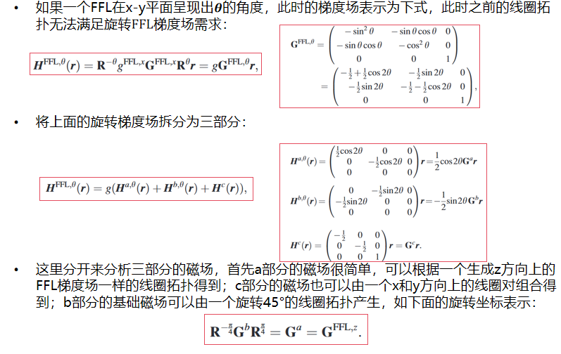

  

  

  
  

  

  
