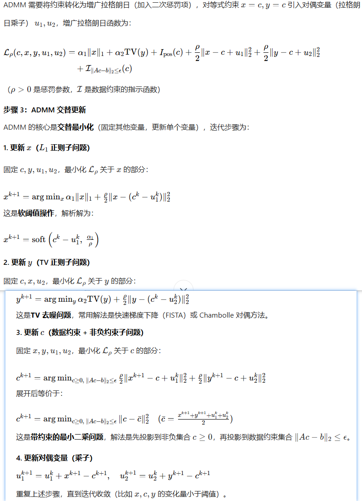
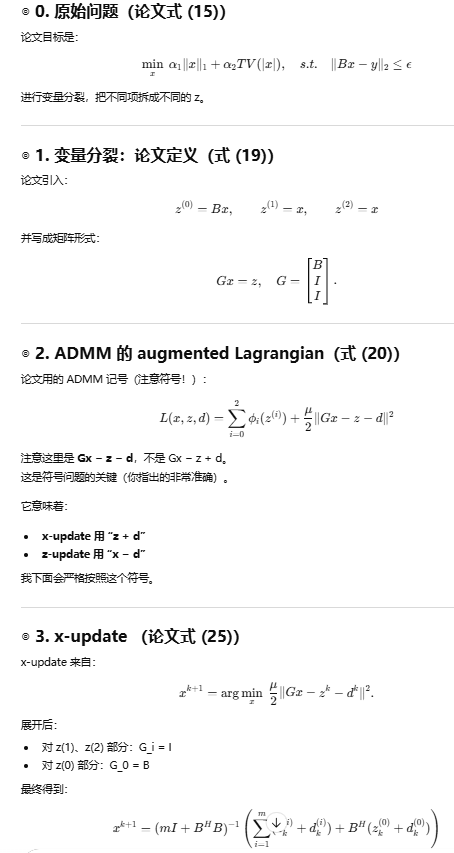
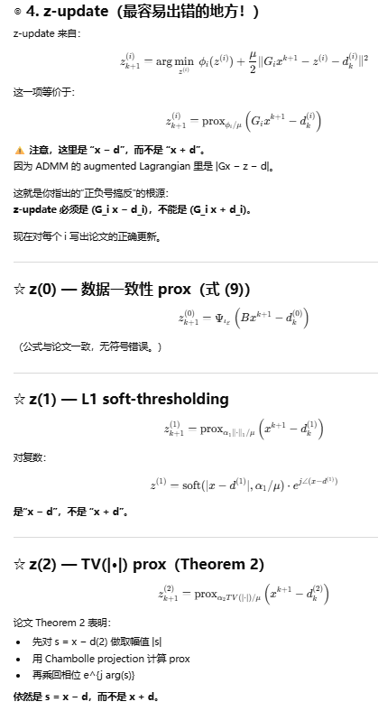
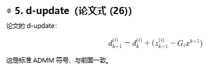
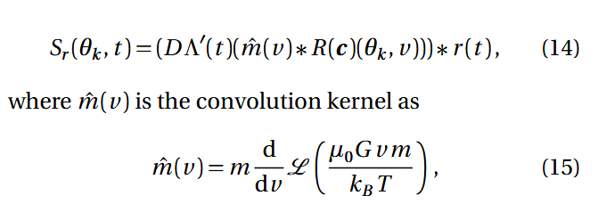
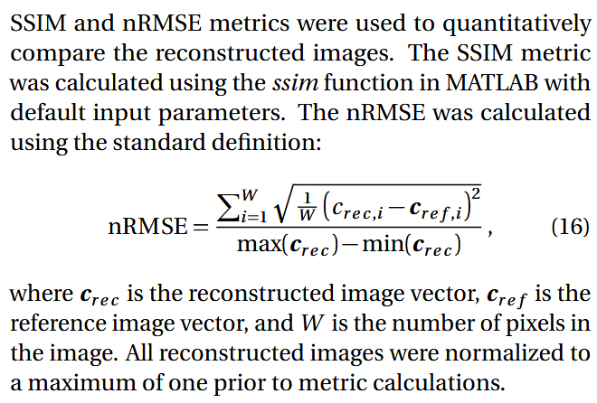

| Paper Name | Year | Publication Venue | Author(1st & Corr.) | Short Summary | Item Number | 
|------|------|------|------|------|------|
| Comparison of System-Matrix-Based and Projection-Based Reconstructions for Field Free Line Magnetic Particle Imaging | 2017 | International Journal on Magnetic Particle Imaging | Serhat Ilbey，Tolga Çukur | 比较了基于FFL的投影成像和系统矩阵成像的性能，主要学习这篇文章对这两类方法的具体实现 | 2017.1 | 
| TranSMS: Transformers for Super-Resolution  Calibration in Magnetic Particle Imaging | 2022 | Alper Gungor，Tolga Cukur |  混合架构实现低分辨率系统矩阵的超分 | 2022.1 |

* **#2017.1**  
  **看文本的初衷是ADMM算法在系统矩阵中的用法，本文的主旨是对比了基于FFL的系统矩阵重建方法和投影重建的重建质量和重建时间，其中投影重建用到了投影X-Space+逆拉东变换；基于系统矩阵的重建对比了ADMM和nonnegative fused lasso(NFL)的效果**，其中NFL的方法在"M. Storath, C. Brandt, M. Hofmann, T. Knopp, J. Salamon, A. Weber, and A. Weinmann. Edge Preserving and Noise Reducing Reconstruction for Magnetic Particle Imaging. IEEE Trans. Med. Imag., 36(1):74–85, 2017."这篇文章中有详细说明。

  一些基础的实验设置：FFL梯度场强度为2T/m，成像大小为48mm*48mm，单个网格点大小为300um *300um，即160 *160的网格节点划分。FFL每次旋转的角度为3度，使用25nm直径的粒子，驱动场场强为60mT，采样频率为10MHz，成像时仅使用1.25MHz以下的频率分量，为消除磁场直馈去除掉了一直到一次谐波的以下全部频率分量，根据SSIM和不同SNR值(无噪音、30分贝、20分贝和10分贝)的标准化均方误差(nRMSE)将重建的图像与参考图像进行比较，其中相对于过滤前原始接收的时间域信号的规范来计算噪音功率。

  在正式开始ADMM算法之前，需要先了解几个概念，这个就不在这里说了--**首先是拉格朗日乘子法和拉格朗日乘子法的迭代更新步骤(减小优化变量，增大乘子)，体会迭代过程中"原始变量最小化 + 对偶变量梯度上升"的思想(即对偶上升法)；但拉格朗日函数仅通过线性项惩罚约束，会出现收敛缓慢+约束违反严重的问题，因此考虑增强约束，即增广拉格朗日，平方级的二次惩罚项会强制要求正则项减小，好处可以详细去看看；ADMM的迭代逻辑源于增广拉格朗日的优化分解，多个变量在一次优化中会被固定其他所有上一轮更新的参数和对偶变量，只更新单个参数，本质上ADMM是增广拉格朗日+交替最小化+对偶梯度上升的结合**，这里需要注意将一次惩罚项写入二次惩罚项的等价形式：

  

  **实际的ADMM算法在上面的基础推导中更进一步，因为既然几个正则化项需要满足多个变量连续相等的条件且变量本身就可以写作向量，就可以讲连续相等的新变量按照行进行拼接形成大的矩阵进行变量约束，同时将数据保真项也作为一个新变量引入，整体的过程可以表示如下：**

  
  
  

  这里需要对本文使用的ADMM算法做一些解释：**首先，这个解决多个正则化项的约束的ADMM是在Cukur组在合成孔径雷达图像重建中的一个工作，在这个问题中正问题的系统矩阵是mask+傅里叶变换，使用场景其实有所不同，在SAR领域待测数据其实也是复数，因此L1和TV等正则化只能在x的幅值上做文章，需要保留相位信息；其次，通过对数据保真项、L1正则化项、TV正则化项设置三个新变量
  $z^{(0)} z^{(1)} z^{(2)}$，然后既然需要做出连等的公式并由此将对偶变量写入二次项中，文章的做法就是直接按照行堆砌构成了一个大的矩阵G，G是由B和两个I堆叠而成构成约束项，这样也将数据保真项作为本身优化的一部分放入
  $z^{(0)}$；还有，L1的解在本文中有所设计，其实就是将矩阵拆分，最后能得到解析解，即软阈值函数，TV的解稍微复杂，是一篇在2005年CVPR上的工作，即Chambolle projections，这个推导稍微复杂，大致的做法就是将TV项看成是梯度之和的最小值，可以求解对偶问题，将求解对象转变为数据的梯度，然后再通过一些简单的变换将梯度转换为原数据，而数据保真项其实更为简单，其实就是构建了一个y为中心，阈值为半径的球，如果满足阈值条件则不处理，如果没满足就拉到球面上；步长
  $\mu$对迭代的影响体现在步长其实就是二次增广项前面的系数，所以他实际对对偶变量和正则化项引入的新变量的更新都会起到一个调节的作用，这样从间接的角度，他也影响了c的更新**，以上就是理解ADMM的一些核心。

  一些在ADMM实验中的细节：**对系统矩阵除了一个F-范数；将复数分解成两部分组成一个长系统矩阵；ADMM中的TV做了简化，只计算右侧和下侧的差值(和那篇推崇L1+TV的文章区别，即NFL的文章)；设置了单次更新差值大小检测的收敛停止条件；初始的迭代起点值是最小二乘解结果**

  对本文使用的投影重建做一些解释：这篇文章的结论是建立在2015年Buzug组"Electronic Field Free Line Rotation and Relaxation Deconvolution in Magnetic Particle Imaging"基础上的，这篇文章的理论推导又可以说是建立在之前旋转+平移的FFL场和拉东变换的那篇文章基础上的，所以如果不清楚这个公式的推导可以去会看拉东变换的那篇文章，我们给出下面的公式(其中卷积核应该是还有一个
  $- \mu_{0}$的，可以自行甄别)；**重建方式是跟拉东变换一样的，区别在于最开始用了Wiener滤波消除了弛豫的影响，即滤波消除时域弛豫卷积，之后通过多频道值消除点乘为0的角度，进行频域操作，消除空间卷积效应，之后得到各角度的FOV范围内的投影值使用FBP等算法进行反投影**，卷积后的结果有的为负，将其转换为0且最后输出的图像被标准化到0-1：

  

  文章中评价重建质量的指标为SSIM和nRMSE，具体的计算方式如下：

  

  总结一下实验结果：基于逆拉东变换的重建时间极短(10-20ms)，基于系统矩阵的ADMM和NFL拥有相近的性能表现，同时相比逆拉东变换的重建质量和SSIM数据都有明显的上升。

  总结：**其实如果看完之前的一系列文章，这篇文章基本没做什么，就是把拉东逆变换、NFL、ADMM的几种方法都实现了一下，做了一个对比，但文章的意义主要在于可以看清楚ADMM算法实现的路径是如何的**。

  
  
  

  

  

  

  

  

  

