| Paper Name | Year | Publication Venue | Author(1st & Corr.) | Short Summary | Item Number | 
|------|------|------|------|------|------|
| The X-space formulation of the magnetic particle imaging process: 1-D signal, resolution, bandwidth, SNR, SAR, and magnetostimulation | 2010 | TMI | Patrick W. Goodwill，Steven M. Conolly | 一维X-Space | 2010.1 | 
| Multidimensional x-space magnetic particle imaging | 2011 | TMI | Patrick W. Goodwill，Steven M. Conolly | 多维X-Space | 2011.1 | 
| The Impact of Filtering Direct-Feedthrough on the x-Space Theory of  Magnetic Particle Imaging | 2011 | SPIE Medical Imaging | Kuan Lu, Steven Conolly | 通过直流信号弥补基频信号丢失 | 2011.2 |
| Relaxation in X-Space Magnetic Particle Imaging | 2012 | TMI | Laura R. Croft, Steven M. Conolly | X-Space方法中对弛豫加以分析，一阶Debye理论 | 2012.1 | 

* **#2010.1**  
  **1D的文章不仅详细叙述了1D X-Space成像理论，还分析了X-Space理论下的分辨率、带宽、SNR、SAR等成像特性**。
  
  空间分辨率根据卷积核的FWHM确定，因此空间分辨率表示为梯度和粒子浓度的函数，尤其是粒子直径以三次方的形式与空间分辨率呈反比。
  
  影响MPI成像FOV大小的主要因素是磁刺激。
  
  带宽的分析稍微复杂(详见文章)，卷积公式中的卷积核是朗之万函数的导数，为了在DFT中方便表示，将朗之万函数表示为近似的洛伦兹函数(傅里叶变换的结果是离散的指数函数)，简化推导将粒子浓度表示为三维上的delta函数，消除掉卷积的积分形式，指定-3dB的带宽要求，其实就是在边界频率上的功率值为峰值功率的一半，计算得到：MPI扫描仪的带宽要求和朗之万函数中的k、梯度值、扫描速率成正比，这里引入了扫描速率，扫描速率用于表示FFP位置与时间的关系(文章这里的意思是无论FFP轨迹怎么变，当前时刻都能得到一个线性变化参数)。
  
  进一步分析容易得到的结论是，空间分辨率和带宽之间有一个tradeoff，两者是正相关的成像特性，但之前分析的接收端的线圈带宽有限，再给定带宽的情况下，最终接收到的信号通过了一个brick-wall filter，相当于扩大了X-Space方法的卷积核FWHM，造成分辨率的进一步丢失。
  
  SNR的分析同样建立在带宽的分析基础上，可以得到粒子分布下的最大信号值(即卷积核峰值处)，通过建模放大器噪声、接收线圈噪声和体噪声，将噪声设置为玻尔兹曼噪声，通过SNR的计算公式计算，并引入了对3D情况下X-Space的分析(这里就是典型的一维笛卡尔轨迹)，得到三维的SNR与粒子直径、信道数、磁粒子中心磁化强度、FOV大小和梯度场强度等因素有关。

  **实验在zerodimensional MPI spectrometer进行**，通过一个静态均匀磁场模拟一个放置样本的位置，同时用另一个动态均匀磁场模拟FFP的运动情况，其实就是MPS的采集模式。

  文章涉及的1D X-Space推导如下：

  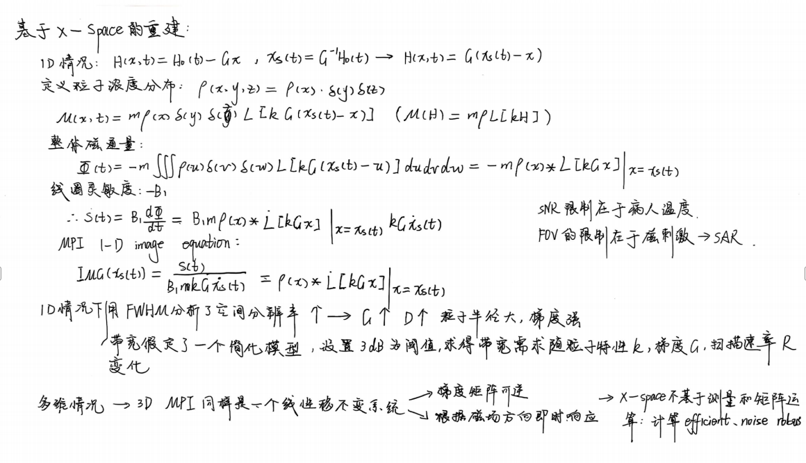

* **#2011.1**
  **多维MPI中详细推导了多维MPI的信号方程和图像方程，介绍了X-Space方法实际解决MPI重建问题的流程，并对公式中的PSF包络做了详细的分析**。

  文章涉及的多维X-Space推导如下：
  
  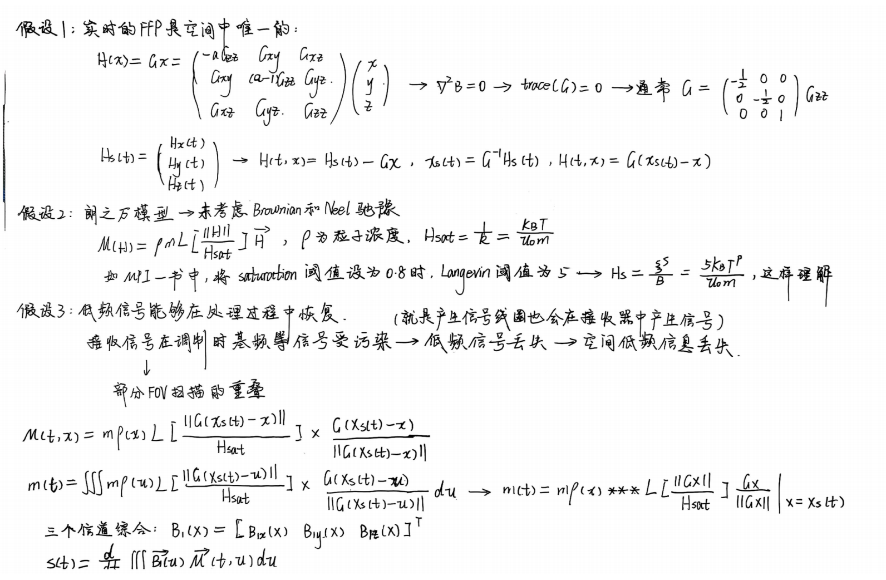
  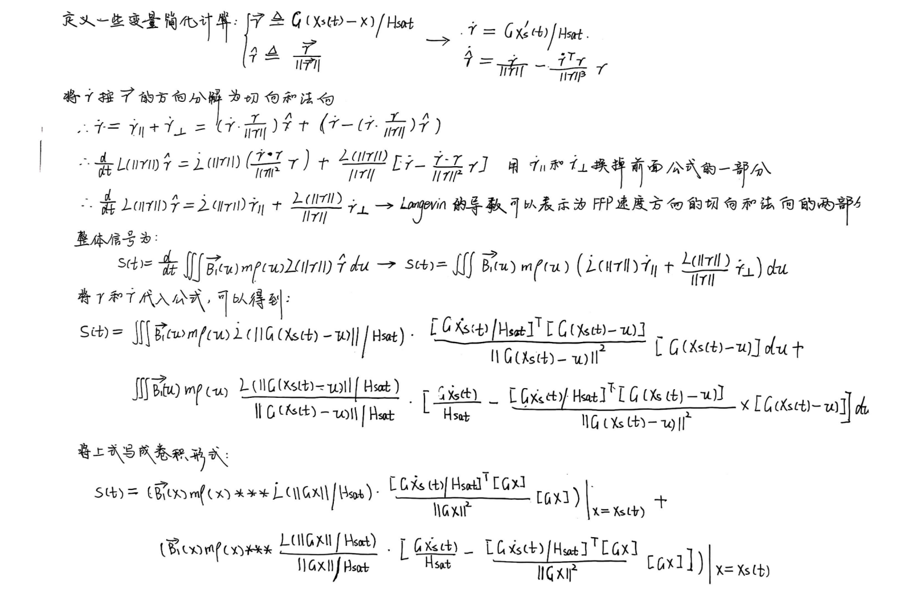
  

  上述第三张推导中提到了
  $ENV_T$和
  $ENV_N$这两个径向对称的标量(在朗之万函数或朗之万导数的部分的内容都是标量值)，这里文章一般采用切向和法向描述这两个PSF标量，划分标准是公式推导中按照切向和法向对总的向量导数做了分解，法向PSF标量通过数值分析的FWHM更宽(大概是切向的2.3倍，梯度设置是二维的-1和1的公倍数，这样的梯度场设置就使得PSF的空间形状是轴对称的)，切向PSF标量其实也就是一维X-Space方法中的PSF，因此法向PSF的出现使得多维X-Space的空间分辨率进一步下降。

  第二部分的分析是针对整个PSF的h(x)而言，假定此时的FFP方向是x轴的方向(这符合X-Space的使用场景，实际上在丽萨荣轨迹当中使用很少，更多的还是单线扫描平行移动的方法)，由于真实的卷积核是PSF乘上FFP速度，因此可以在三维情况下对PSF(h(x))进行拆分，大致的情况如下：

  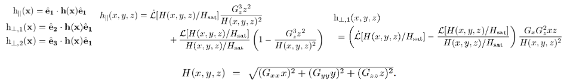

  共线的卷积核部分类似之前PSF的切向和法向的叠加，因此整体在二维的磁场设置下还是一个径向的包络形状，但垂直的卷积核部分不同，呈现出两个波峰的形状，这样叠加反而使得卷积核的形状大变，这也解释了与FFP速度贡献的PSF分量FWHM更小，代表着这个方向上更好的分辨率。

  多维X-Space方法真正用于重建还需要从信号方程中构建得到图像方程，其实就是将卷积以外的所有部分的影响全部消去，因为在多个方向中都会产生电压信号，因此MPI的图像方程处理方式是对每个时间点的电压信号点乘上该时刻的FFP速度(也可以看成是与FFP速度共线的方向上分辨率更高，所以才如此设置)，这样整体的公式如下：

  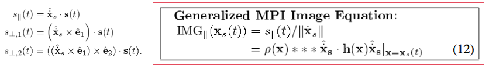

  **重建中有两个问题需要解决，一个是插值，其实就是将某个时间点的电压信号对应到具体的空间位置，然后在划分的网格中对应到具体的某个像素点；另一个是解决基频信号丢失的问题，这个点在另一篇通过直流信号+Partial FOV的方式解决。X-Space方法其实并不关心如何解决反卷积问题，作为一种无需重建公式、实时对应到具体位置的浓度信息的重建方法，卷积核的blur效果本身就不是X-Space方法想考虑的部分**。

  这篇文章的实验部分是在真实的3D MPI设备中进行的，这台设备是典型的bore型闭合线圈拓扑，在bore的共线方向施加了驱动场，接收线圈也布置在孔径方向，因为FFP速度方向也是孔径方向不会发生改变。

* **#2011.2**  
  **本文解释了为什么通过直流信号弥补基频信号丢失并做了验证实验，另外补充了一些多维X-Space的实验细节**。

  首先一个出发点是基频信号丢失问题是普遍现象，并不是只有X-Space方法需要解决的问题，基于系统矩阵的方法同样需要针对性解决这个难点。文章的主要内容包含两个部分：一是文章借助了Rahmer2009年分析系统函数的结论进一步分析了低频分量的电压信号对图像造成的空间频率影响；二是从易到难设置了从仿真到真实的四组实验验证结论，真实实验使用到了多维X-Space那篇文章的设备。

  高通滤波一般会进行叠加，整体的滤波效果不光是去掉了基频信号，也会同时去除部分的二次甚至三次谐波信号。这里需要回忆Rahmer文章中的一个结论，即分析单个频率的系统函数：

  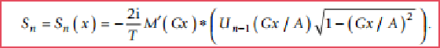

  回忆这个公式的推导过程能得到以下结论：首先这个公式的前面有一个虚数单位，后面的卷积核和第二类切比雪夫多项式无论在什么空间位置的取值都是实数值，这样导致整个频域的系统函数在所有位置都是只包含纯虚部的，配合傅里叶变换的复指数基函数的乘积求和，才能得到时域的纯实数信号(这一部分可以自行写一下傅里叶变换的公式)，另外傅里叶变换的复指数基函数的实数部分既然要被抵消(频率分量的复数单位和复指数基函数的实数部分相乘，相反的频率的这部分结果又能互相抵消，所以我们只关心频率分量的复数单位和复指数基函数的复数部分相乘，这部分最终产生的实数信号才会真正的进入到图像的空间频率当中)，下面这个公式其实就说明了**单个频率的信号在时域是如何影响信号的，这句话有点拗口，但请多理解一下，因为时域信号=\sum频率分量*对应的频率复指数基函数，所以只要加上了三角函数的部分考虑频率分量的值，其实都是从时域中分析信号了**，我们在下面进一步对其在X-Space上进行积分分析：

  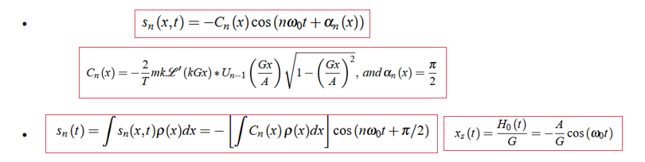

  我们对上面的推导结论进行进一步分析：**首先考虑基频，电压信号的三角函数部分进一步化简得到
  $−sin(ω_0t)$，通过X-Space的成像方程计算粒子浓度时需除以一个FFP的移动速度(上面的公式中其实说明了FFP位置是负的余弦函数，FFP速度即正的正弦函数)，因此X-Space方法中这样的处理直接去除掉基频时域信号中因时间的变化而变化的三角函数部分，整体的X-Space基频信号呈现出常数分布**；**二次谐波下，三角函数转换为
  $-sin(2w_0t) = -2sin(w_0t)cos(w_0t)$，还是除以一个FFP的移动速度，导致最后的时域信号会呈现出一个余弦的影响，但如果我们将这个余弦的时域影响转换为X-Space，其实就对应到FFP位置，此时如果以空间位置度量，二次谐波的影响在空间域表现为线性**。

  根据上面的推导，我们完全可以将各个频率对于空间频率的影响解耦，即**各频率分量之间互不影响，当某一频率的信号分量丢失或被滤波器滤走后，只需要单独考虑这部分分量对X-Space图像域的影响，通过位置函数的方式对图像数据进行弥补**。

  仿真实验有两组，第一组是一个点源的粒子分布，他甚至没有去仿真线圈等物理装置，只是人为的去除了两个低频，然后通过上述分析进行还原，可以看到当去除一倍基频时，和理想的粒子信号相比就是少了一个直流信号，但去除二倍基频时，和理想的粒子信号相比就是少了一个和空间位置呈正相关的线性信号：

  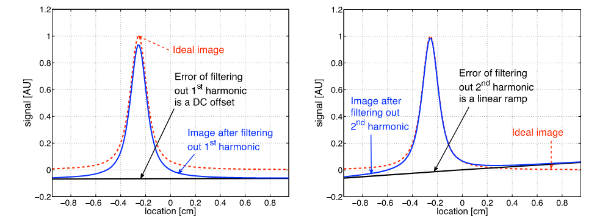

  第二组的phantom设置更为复杂，且线圈拓扑和直流反馈都通过仿真实现了。

  真实实验的第一组不多说，也是一个点源验证，第二组细说一下，是一个间隔逐渐增大的柱状phantom，因为使用的是多维X-Space的那台扫描仪，驱动场的移动方向一直是bore的轴向，但成像二维图像时需要另外一个方向的扫描和轴向的长度增大，因此加入了一个**Partial FOV**的方法，Partial FOV互有重叠部分，在另外的一个y方向成像了20个FOV(这个方向上其实相对独立)，y方向上进行拼接，但在bore的轴向也进行Partial FOV的拼接，且这个方向的FFP移动位置是可以对应到图像方程中的，这样就可以用线性补偿的方式添加二次谐波的空间影响(这是多维X-Space扫那个"CAL"phantom的策略)，但我个人估计这篇文章去成像那个间隔逐渐增大的柱状phantom是将其看成是一个一维MPI，此时拼接是把扫描方向进行加长，这样在重叠的方向就直接能对应到线性补偿。另外在这里多说一点，**X-Space重建的结果本身就对应于电压信号，所以在一维的情况下重建结果的形状和电压信号的形状非常接近，同时X-Space重建的结果没有有意义的单位，因为她本身就省去了很多的常数项，重建的结果能比较的主要就是相对效果，因此直流+线性的补偿结果本身就有点随意？我现在看懂了真实的这个情况是怎么处理的了！它其实根本没有考虑二次谐波的影响，假定在重叠的部分相同的情况下，单次Partial-FOV内部的直流偏置是常数并不是整个FOV的直流偏置是常数，这样在重叠部分假定相等的情况下，单个Partial FOV的结果整个往上调往下调配合前一个Partial FOV的边缘结果，这样就能描出一条非常光滑的电压信号线，但我个人认为在只能在单个Partial FOV中加上那个直流偏置，然后再进行单个Partial FOV的X-Space重建才能对重建效果造成影响，这个偏置补偿还是针对于测量信号的**，具体可以去看这篇文章中的实验图，现在来看实验做的不够。
  
  * **#2012.1**  
    **Goodwill组在自己设备上验证了弛豫对于MPI信号的影响，采用一阶Debye理论解释并分析了弛豫现象，推动了考虑弛豫的X-Space方法的发展，以当前的视角来看其实Debye的弛豫模型过于简单了，没有单独考虑尼尔弛豫和布朗弛豫对信号的影响**

    这篇文章并没有提出弛豫的解决方法，只是在理论上分析了弛豫的效应并在实验中验证了理论的正确性，对于X-Space的方法发展，显然研究弛豫是一个非常重要的方向(但这点和基频丢失很相似，不只是X-Space方法会遇到的问题)。

    X-Space理论都建立在一个adiabatic的设想下：磁粒子的磁化会随着外部磁场的改变而瞬时改变，但实际情况不是这样：首先在非热平衡的状态下，磁粒子的磁极会发生随机的旋转；再例如因为黏度等物理因素会阻碍粒子发生瞬时的旋转......上述种种会导致粒子的磁化出现弛豫现象，弛豫会严重地阻碍粒子发生瞬时磁化，这篇文章中采用一阶Debye模型描述这一现象。弛豫能帮助从理论分析到理解真实磁化现象的桥梁，只有对弛豫足够了解，才能更好地解决因为弛豫导致的MPI blurring，从而达到一个更理想的磁化强度和图像分辨率。**X-Space方法成立的三个前提**：第一个是FFP位置必须在某一时刻是唯一的，因为时间信号一一对应到图像域上，如果没有一一对应的关系，无法建立图像域数据，唯一的FFP位置需要通过高度均一的磁场保证，但通常在20%的磁场生成偏差以内，仍能保证这一前提依旧成立，总结为能通过硬件设计解决这个假设；第二个是一次谐波的信号是可恢复的，这在前面那篇分析基频丢失的文章中有详细的理论说明，因此可以通过Partial FOV叠加的成像序列选取方式解决这个假设；第三个是磁粒子磁化强度的变化是瞬时的，这个假设显然在真实情况下无法成立，因此这篇文章的意义就在于此，通过对弛豫的理论分析得到弛豫对图像的真实影响并对此评估。

    Debye模型中最重要的两个公式如下(左边的公式描述了真实的磁化强度会根据当前磁化强度和当前时刻的理想磁化强度的差值以一个线性的比例作为变化速率，右边的公式即求解这个一阶线性微分方程可以得到，最终的结果表现为实际磁化强度是理想磁化强度在时域的指数卷积信号，即当前的信号是由前面的众多时间点的影响集合得到的，u(t)是一个heavyside函数，用于区分真实时间点只会发生在正数区间)：

    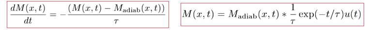

    在理想磁化强度下，X-Space的信号方程表现为空间域的PSF的卷积信号，因此实际的考虑Debye模型的信号可以表示为，即弛豫的影响表现为时域的卷积：

    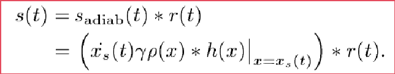

    这里是一个需要加强理解的地方：X-Space成像方程通常会计算一个FFP速度补偿(详见多维X-Space的图像方程部分)，得到的信号才能插值到图像域中，但引入弛豫后图像方程需要做一个修正，即当前FFP位置的峰值信号会延迟大概半个弛豫时间常数，这里文章给出的解释是这个半个弛豫时间常数的修正是总结和估计出来的结论，非常符合实验中观测到的情况(速度补偿中考虑时间是一定需要的，因为磁化本身受到影响，使得FFP速度也一定不是即时响应的，但主要的理解点在于如何取定这个弛豫时间)：

    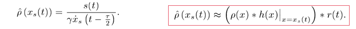

    在理论说明的最后一部分文章中用一个示意图(类似是上述所有理论部分的一个仿真)解释了弛豫带来的时间卷积的效果，以一个一维的电源分布为例，初始的空间域卷积在一维方向上形成对称的blur，而弛豫对这个图像分布造成的blur则和扫描的方向挂钩，如果扫描方向是正的，那么就会在正方向上出现一定程度的blur，反之扫描方向为负时也会出现对应的模糊，这是这篇文章一个比较经典的结论：

    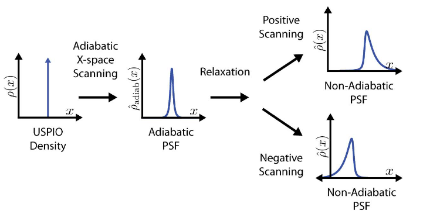

    实验中需要确定一个固定的弛豫时间常数，文章的解决方法是**以较高频率采样十个周期内的信号，2MHz的采样频率足以捕捉毫秒级的弛豫时间常数，通过data-fitting的方式计算在特定时间常数下的弛豫磁化强度与采样信号进行对比**，因为前面对于时间卷积的一维分析，因此实际上在同一个线性区域的正向扫描和负向扫描时，弛豫时间常数是分开计算的。

    作者认为时间弛豫对MPI成像的影响主要体现在两个方面：**第一个是不对称的模糊效应，从PSF的实验结果可知，在原本图像域弛豫的基础上，PSF的FWHM更大，MPI中的空间分辨率和FWHM呈正相关，因此弛豫的出现使得MPI的空间分辨率降低；第二个是SNR的降低，PSF的峰值随着弛豫有所降低，但同时噪声功率并未下降，表现为信噪比有所损失**。
    
    

    

    
  
  
  

  
