| Paper Name | Year | Publication Venue | Author(1st & Corr.) | Short Summary | Item Number | 
|------|------|------|------|------|------|
| Signal encoding in magnetic particle imaging: properties of the system function | 2009 | BMC Medical Imaging | Jürgen Rahmer，Jörn Borgert | 全面对系统函数形状和性质做分析 | 2009.1 | 
| Analysis of a 3-D System Function Measured for Magnetic Particle Imaging | 2012 | TMI | Jürgen Rahmer | 从时域和频域的两个角度分析了系统函数的一些性质，比如混合因子、时域空间形状、高低频信噪比等 | 2012.1 |

* **#2009.1**  
  **本文针对系统函数的形状和性质做出了较为全面的分析，其实在多维情况下的推导不是很理想，主要目的是想建立起系统函数和第二类切比雪夫多项式之间的关系**。

  MPI的正问题公式不多赘述，文章主要关心系统函数，即在浓度是一个狄拉克分布时，对电压信号的积分操作就会转变为一个系统函数的响应，定义如下：

  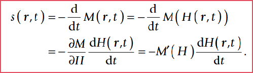

  下面的内容是系统函数在理想情况下磁场激励的频谱响应推导(第一张图是粒子特性无要求+一维的情况，第二张图是理想粒子特性的更进一步简化情况)：

  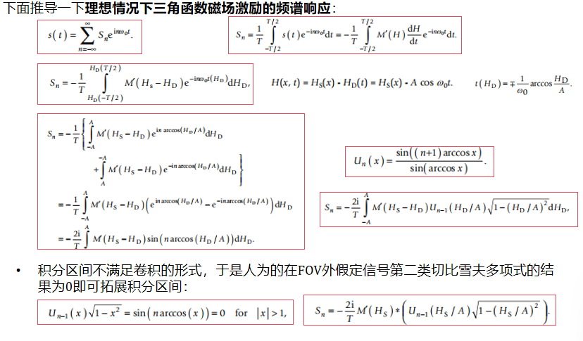
  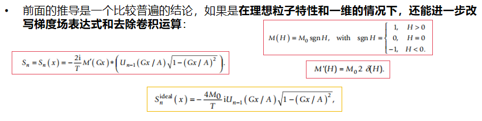

  在理想粒子情况下，文章进一步分析了电压信号的公式，文章中将
  $S_n(x)$ 称为MPI的特定位置的灵敏度图，这里需要引入一个额外的结论：

  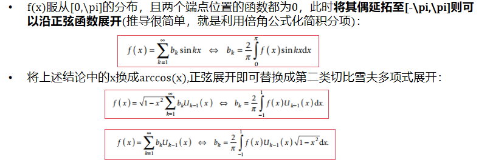

  有了上面的结论，**单个位置的粒子浓度就可以直接表示为多个第二类切比雪夫多项式的线性求和，由于理想粒子的单个频率的系统函数可以对应于一一匹配的n阶第二类切比雪夫多项式，这样理想粒子浓度还可以表示为多个理想系统函数的线性求和，另外，系统函数可以表示为磁化曲线导数和第二类切比雪夫多项式的卷积结果，因此系统函数还可以是磁化曲线导数和理想系统函数的卷积结果**，上述推导可以表示为下图：

  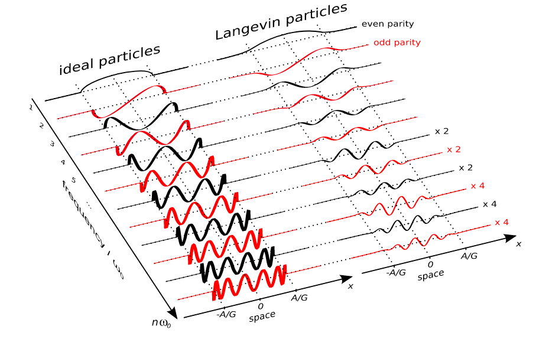
  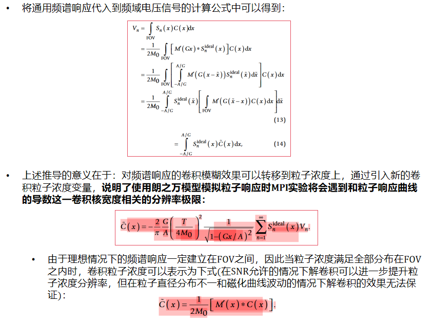

  下面的这张图说的是通过得到理想情况下的粒子浓度和电压信号的关系后，可以建立起系统矩阵的逆和系统矩阵转置的关系，个人觉得意义不大：

  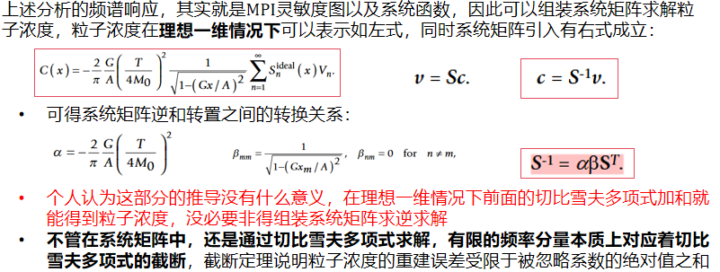

  多维情况不多说了，效果不佳，且推导其实就是举一反三，关于系统矩阵单频率分量的形状分析，个人认为在那篇Knopp组关于迭代重建算法+权重矩阵改写+系统矩阵形状分析的文章中更加详细，指个路："./Knopp.md #2010.1 "

  
  

* **#2012.1**  
  开始找到这篇文章的初衷是'Online reconstruction of 3D magnetic particle imaging data(2016年的实时重建框架)'，文章中提到了系统矩阵单行(单一频率)下的SNR阈值帮助筛选重建需要的系统矩阵行，这一做法最早是从Rahmer的这篇2012TMI出来的。
  
  文章开头提到3D系统函数的特征是决定空间成像和spatial encooding process的关键，因此从时域和频域两个角度对系统函数做了一个比较全面的分析。
  
  Introduction中提到了一些和本文无关但比较重要的内容：首先MPI可以在无需考虑重建问题的情况下得到图像(这是Rahmer组自己的说法)，其实就是要么采用2005年Science中的方法，使用较小的调制场配合梯度场，只有极小范围的粒子产生信号，其实也就是MPS的成像模式(之所以使用系统矩阵就是单一时刻有多处粒子产生信号需要通过系统矩阵进行定量)；要么就是Goodwill组基于X-Space的方法，Rahmer组认为这类方法其实就是通过时域信号对应到具体的FFP位置的粒子浓度，但同时Rahmer组提到了**X-Space目前只适用于线性的FFP轨迹，单向笛卡尔轨迹需要通过机械装置或聚焦场进行位置调整，因此X-Space方法虽然成像速度快，但总的来说完全不符合即时成像的要求**，Rahmer还认为**反卷积的方法无法直接推广到2D和3D场景**；**对于快速成像，成像轨迹需要满足快速致密的特性，因此Rahmer推荐使用丽萨荣轨迹，但丽萨荣轨迹下的信号无法得到精确的图像数学变换公式，因此只能妥协于系统矩阵的方式建立测量信号和粒子浓度之间的关系，同时系统矩阵的建立可以在时域中进行，时域SF保持了与FFP空间位置的链接，也可以在频域中进行，频域SF能提供其他有用的信息且反映频谱过滤的影响**
  
  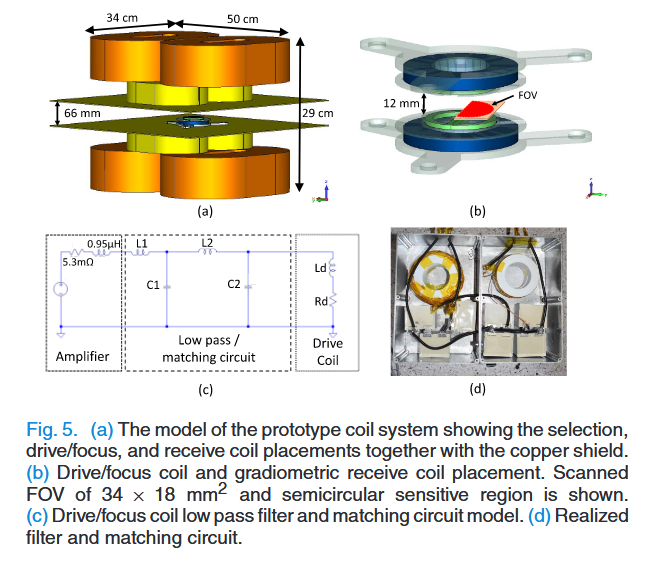
  
  上述为丽萨荣轨迹下的MPI扫描使用到的扫描设备，z方向上的永磁体和线圈提供三个维度上的梯度场(只需要一个方向的maxwell coils就可以提供该方向上更大且三个方向上都有的梯度场)，同时z方向上的梯度场线圈也充当了z方向上的驱动场线圈，堆栈式的绿色线圈表示其他方向上的驱动场，由于设备本身是孔径插入待测样本，所以在x方向上使用筒形的线圈，图像中蓝色的是接收线圈，排布和驱动场线圈类似。
     
  设置的丽萨荣轨迹的单个驱动场频率大约是25kHz，具体为
  $f_x / f_y / f_z = 24.51 / 26.04 / 25.25kHz$,根据公因子计算最小循环周期为
  $T_R = 21.54ms$，同时根据文中给出的梯度场梯度可以计算出FFP的运动范围为
  $13.1 * 13.1 * 6.5 mm^3$，信号采集频率为20MS/s，在10帧之间做平均即可得到真实的信号采集频率为2MS/s，有了上述的一些具体硬件参数，我们可以考虑重建问题如下：
  
  $$
  minimize  ||\mathbf{W}(\mathbf{Gc}-\mathbf{v})||^2 + \lambda ||\mathbf{c}||^2
  $$
  
  上述公式中，很重要的一个点就在于如何表示SF矩阵，在基于物理模型的方法无法正确描述磁化现象的前提下，显然用校准测量得到的系统矩阵更精准，需要注意的是，在系统矩阵的测量过程中，测量范围通常需要大于FFP实际的轨迹范围，因为实际FFP不是一个点，磁化的影响要超过FFP覆盖的范围，文中实际的网格大小为
  $28*34*20=19040$，采样点为
  $3*43084=129252$，但在这篇文章中为了定性去分析一些现象，选择拆分三个频道的信号各自构建系统矩阵，在这样的实验条件下，频域的基频由循环周期确定，最高的频率可以到2MHz，同时文章在这里引入了 **混合阶数，即三个混合因子的绝对值之和**的概念，即：  
  $$$
   \mathcal{f} = | \mathcal{n_x} \mathcal{f_x} + \mathcal{n_y} \mathcal{f_y} + \mathcal{n_z} \mathcal{f_z} |
  $$$

  仿真实验中，使用比奥萨法尔定律尽量模拟类似实验情况的磁场数据，同时忽略了弛豫效应和各向异性，仿真中包含一个与真实噪声水平匹配的高斯白噪声。

  **对实验和仿真的系统函数的分析是本文的重点**，主要围绕文章中的几张图展开：首先分析时域系统矩阵，时域系统矩阵如果在三维中表示出来可以认为是梯度场对于信号的定位效果，一个很明显的观察是信号响应位于FFP的速度矢量的侧面，且延伸到FOV相当大的一块区域之内，如图：

  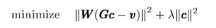

  从实验结果来讲，能从时域系统矩阵的包络中得到的信息相当有限，转战频域：

  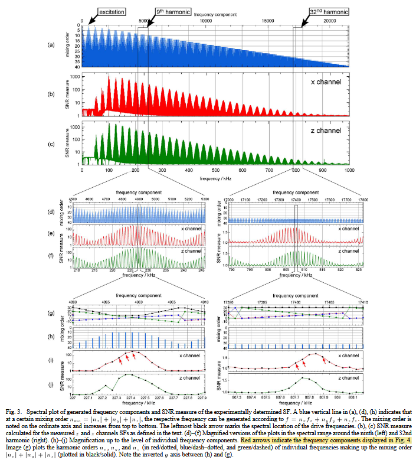

  这张实验图有很多的内容，(a)主要分析了按照基频作为1倍的单位，一直到采样最高频率的各频率混合阶数的大小，混合阶数越来越大的同时频率分量也在越来越大，高混合阶数的情况下，峰宽变大，导致多种混合阶数出现重叠，一些较大的频率分量出现多种混合阶数的情况，(b)(c)分析了x和z频道中的SNR大小，基本可以看的出来走势和混合阶数类似，(d)(e)(f)是选定混合阶数为9和混合阶数为32的峰值部分的放大情况，(h)(i)(j)则进一步将上述的信号放大观察，这两个放大的操作都以混合阶数、x和z频道上的SNR展开，这里提到了最开始来看这篇文章的初衷，即**这里的各频率分量的SNR是如何计算得到的，其实就是将粒子信号的范数和空腔信号的范数做了一个比值作为了SNR**，在最精细的(i)(j)中，观察到的SNR峰值基本走势也和放大后的混合阶数走势相符，这在很大程度上说明在较高的频率范围内，较低混合阶数的频率分量贡献了较高的信号；但在32的混合阶数中，总的混合阶数貌似在小范围内变化不大，但SNR也出现了一个明显的峰值，作者分析认为这需要通过(g)的右侧对三个频道的混合因子分离才能得出结论，即在混合阶数大致相同的情况下，三个混合因子比较接近，没有哪个非常大的情况下SNR也会有所提升，这同样说明光靠混合阶数来判断SNR是否出现峰值是不可靠的。

  对整体的混合阶数和SNR做分析之后，可以对具体的单一频率的spatial pattern(即三维的形状包络)做一点分析，基本的一个现象是低混合阶数的形状更粗糙，高混合阶数的形状更精细：

  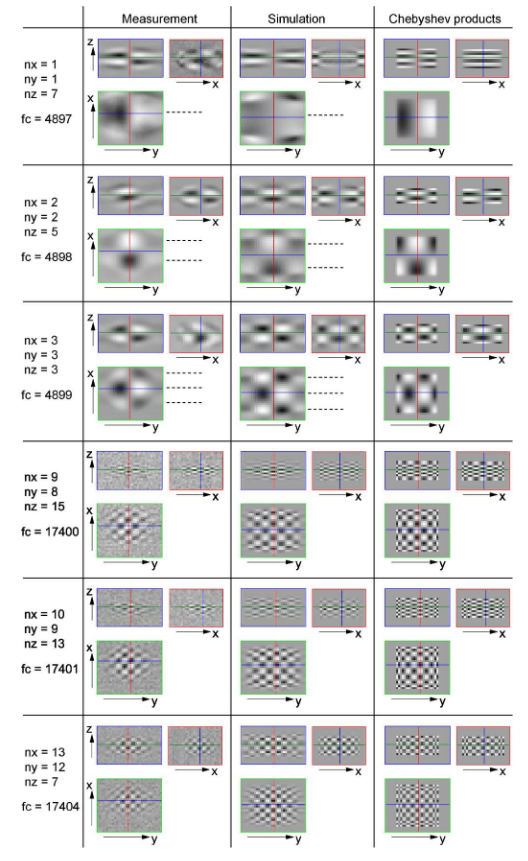

  图片展示中同时对比的两栏分别是在30nm直径下的仿真系统函数展示和通过观察较为粗糙的系统矩阵的极值个数来确定的第二类切比雪夫多项式的垂直乘积(这个不是一个普适结论貌似)，第二类切比雪夫多项式和单频率系统矩阵的关系在Rahmer的那篇分析系统函数的工作也有讲到，可以预见的是在卷积核的卷积作用下一定会和第二类切比雪夫多项式出现一定的差异，但又有一定的相似性，同时在那篇文章中，实际上2D和3D的情况下卷积形式是没有通过精确的卷积公式表达的，因此这是利用第二类切比雪夫多项式解决系统函数问题的一个遗憾。

  此外，在混合因子的绝对值相等的前提下，由仿真和第二类切比雪夫多项式得到的结果都具有高度的相似性，甚至可以说只有正负符号上的差别，但其实在真实实验数据下这个现象并不是很明显，这说明朗之万去拟合磁化特性是远远不够的：

  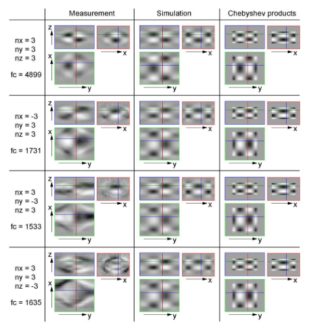

  此外，由于磁化曲线卷积核的影响，实际的频谱信号会出现一定的扭曲，因为粒子直径直接决定了磁化曲线求导的峰值宽度，因此可以分析不同粒子直径对于频谱信号的影响：对于更大直径的粒子，是能提供更高频的可用信号的；同时在特定的频段，侧脸得到的SF包络可以和特定直径和铁离子浓度的仿真互相匹配，所以得到了这篇文章的最后一张实验结果图：

  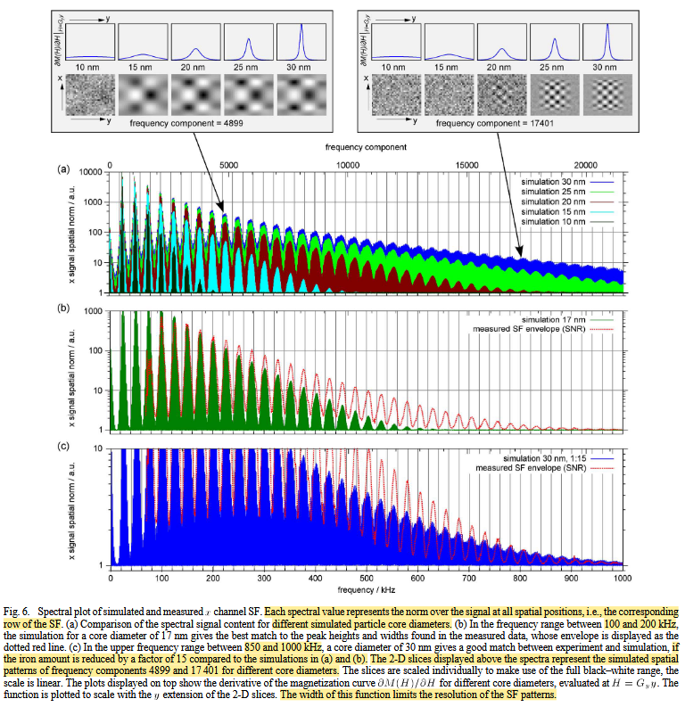

  **实验过后的结论分析和总结**(观点按照分号进行区分)：时域系统函数的可视化说明MPI不是单纯的点响应成像方法，反而可以编码比较大的一块区域，这可能允许一些密度较低但更快的FFP扫描轨迹出现；上面的一个实验中分析得到，当混合因子的绝对值相等时，理想的系统函数形状只会出现符号上的区别，因此单通道SF中只有约25%的分量代表独立的spatial pattern；如果将单频率的系统函数看成是MPI重建过程中的一组基函数，那么单个基函数在不同FOV区域的空间频率上的影响是不同的，同时卷积核对系统函数的影响首先出现在高频分量的图案边缘的精细空间结构上；即便在真实的实验场景下通过高通滤波去除了很多靠近基频的信号，但其实也只有混合阶数为1、2、3的共计31种不同的频率组合方式受到影响罢了(只有在混合阶数比较低的情况下SNR才高，信号才真正具有实际影响)，这些低混合阶数的情况因为对应的空间频率也很低，完全可以通过重建公式中的正则化加以引导改进，同时，改进的硬件装置也可能在未来将受影响的高SNR频率分量控制在混合阶数仅为1的三种情况中；系统能达到的最小分辨率可以由不被噪声淹没的处在混合阶数最小峰值的频率分量的spatial pattern决定，同时测量SF中的绝大多数可用信号都在较低的频率分量中，这导致信号中缺乏空间高频信息，因为受到卷积核的影响高混合阶数对应的高频分量受到扭曲，真实粒子都是有一个直径分布的(对数高斯分布)，因此实际上只要有大直径的粒子，都会对高频分量的细节保留有所帮助；如果MPI希望达到亚毫米级别的分辨率，则在一些对应的频率分量中必须提供足够的SNR，且在一些真实的实验场景中我们不得不拿一定的空间分辨率换取足够的SNR；文章中提到了使用MPS的设备模拟在MPI设备中的特定位置，此时可以在MPS设备中使用更大的校准测量样本，这样能获得更大的SNR值；在重建过程中，可以使用加权的方式来选择频率分量和赋予某些具有精细空间模式的频率更多权重，同时实验中展示的真实系统函数形状不满足25%相似性这一点，充分说明了当前基于模型的系统矩阵构建还不够完善(朗之万曲线、粒子各向异性、粒子弛豫等等)。

  回答最后看这篇文章的初衷，计算SNR的方式，即对粒子信号和空间信号做比值，下面的公式中其实就是单个频率下各个空间位置的平方和根：

  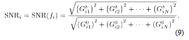
