| Paper Name | Year | Publication Venue | Author(1st & Corr.) | Short Summary | Item Number | 
|------|------|------|------|------|------|
| Online reconstruction of 3D magnetic particle imaging data | 2016 | Physics in Medicine & Biology | T Knopp and M Hofmann | 伪实时的在线MPI重建框架(延迟约为2s，边测量数据边成像) |2016.1 | 
| Weighted iterative reconstruction for magnetic particle imaging | 2010 | Physics in Medicine & Biology | T Knopp, T M Buzug | 线性重建问题中引入权重矩阵+频率筛选+迭代算法提升重建质量，解读了Kac和CGNR | 2010.1 | 
| Edge Preserving and Noise Reducing  Reconstruction for Magnetic  Particle Imaging | 2017 | TMI | Martin Storath, Andreas Weinmann | NFL方案替代了tikhonov，并且设计了一个针对于MPI的离散化TV处理方式，在狭窄血管场景下达到SOTA | 2017.1 | 
| 3d-SMRnet: Achieving a new quality of MPI system matrix recovery by deep learning | 2020 | MICCAI | Ivo M. Baltruschat，Tobias Knopp | 最早使用超分CNN实现低分辨率系统矩阵的超分，战胜当时基于压缩感知的SOTA | 2020.1 | 

* **#2016.1**
  这篇文章的噱头很足，因为在临床场景下实时成像是必需的手段，因此如果从重建的角度来讲，这篇文章没有什么新东西，但这个方向很重要。
    
  2015年MPI的第一台商业设备问世，标志着MPI技术进入临床前研究状态，但在真实的临床场景中，offline的重建会使得在临床阶段没有及时的信息反馈，因此需要构建一个online的重建框架，以文章中的成像场景为例，采集数据帧数可达46帧/秒，意味着需要较快的重建速度与之配合，以往的很多研究没有考虑在线重建主要是因为MPI技术还在萌芽阶段，很多研究主要围绕灵敏度和空间分辨率，这可以称之为实验室场景下的成像性能研究，因此本文的出发点主要围绕在线重建，这是他主要区别于其他文章的地方。
  
  文章使用**基于系统矩阵**的方式进行重建，在系统矩阵可以存储在内存中的情况下基于系统矩阵的方法有一定的计算速度优越性。同时虽然笛卡尔轨迹在基于FFP和基于FFL的成像中都有很好的表现，但无法胜任实时成像的任务，在多维的情况下，只能使用**丽萨荣轨迹**进行实验。构建系统矩阵的线性方程组后，使用Rahmer 2012 TMI的方法计算得到单一频率下的SNR值，**对系统矩阵的行做进一步减少，注意这里减少频率的操作需要慎重，因为频率少噪声也少，但指导重建的数据也少，同时在这样一个在线重建框架中，矩阵的行数也直接决定了重建算法的执行时间**。这里使用的Kaczmarz算法是在MPI系统矩阵的病态程度较高的基础上进行改进的，这里引入了一篇新的文章"Weighted iterative reconstruction for magnetic particle imaging, Physics in Medicine & Biology,T Knoppm, 2010"

  离线图像重建中更注重优化图像质量而忽略了相当程度的重建时间和算力消耗，但在在线图像重建框架中的重点就是低延迟可视化，这需要重建过程的短时间和低延迟。同时数据采集过程的速度会比重建过程更快，因此在这样的情况下实现低延迟的关键想法是**避免逐帧处理数据，始终重建最新的帧，预加载系统矩阵到主存中，并直接将重建数据显示在屏幕上，并不写入磁盘**，一个丢弃帧的替代方案就是平均数据，即将一个范围内的电压做平均，在平均电压信号上解决重建问题。

  可视化有多种解决方案，可以做体渲染、表面渲染和显示体切片，文中不需要有一个很强的交互性(但实际应用肯定是需要类似体渲染之类的效果)，因此这篇文章选择的是矢状、冠状和横向三个方向的最大投影图像，同时可视化界面中还有一个显示当前帧最大浓度的曲线图。
  
  硬件部分没有什么好说的，成像大小为
  $37.3 * 37.3 * 18.6 mm^3$。

  重建的实验中对比了通过SNR筛选不同比例的系统矩阵行参与重建的结果，使用3次Kaczmarz迭代+0.001的正则化系数(会根据矩阵的迹做一个线性的调整)，简化矩阵的大小介于完整矩阵大小的2.5%和80%之间。

  结果也没什么好说的，在简化矩阵的比例很小时，此时高频的部分会出现模糊，同时重建速度有很大的加快，文章中能做到0.3帧/秒-10帧/秒。

* **#2010.1**     
  成像场景为2D，文章中提到了在"Gleich B, Weizenecker J and Borgert J 2008 Experimental results on fast 2D-encoded magnetic particle imaging Phys. Med. Biol."中分析了一个现象，即对系统矩阵的行做归一化(同时对相应的测量信号也做相同的处理)会产生"更锐利但更多噪声"的图像，但相关文章并没有具体分析归一化是否对图像重建质量有提升。所以本文的出发点在于具体分析线性系统中的行加权对图像质量的实际影响，同时权重的引入还让迭代算法的收敛变得更快。

  重建前的准备，将多个频道的电压信号像堆栈一样垂直放置，且系统矩阵是通过测量得到的。

  重建的数学问题的描述(其实推导很简单，可以参照2012年的综述重建部分)：

  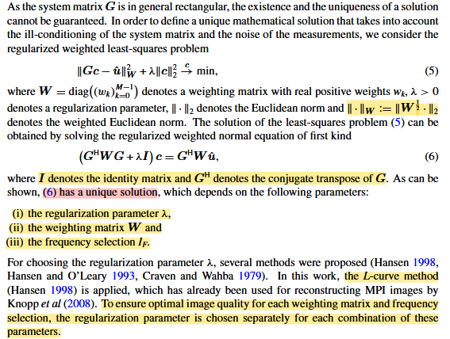

  图中标黄和标红的地方是重点，请注意在改写成公式(6)的情况时，因为被共轭转置的矩阵列满秩，因此公式(6)必有阶且拥有唯一解，本文既然在研究权重矩阵和频率筛选，那么正则化参数可以在特定的组合下使用L-Curve来确定，因此可以分开来考虑。

  既然要分析如何取值权重矩阵和频率筛选，需要从系统矩阵的结构进行分析，**文章中的figure1分析了一些特定频率下的空间模式和各频率的系统矩阵行能量折线图，文章得到的结论和2009年Rahmer组对系统函数的分析类似：在某一方向上的纯谐波频率呈现出线性增长的空间频率，但在一些中间频率(其实就是混合阶数不低的情况下)反而会出现一些高空间频率的现象；但如果我们只考虑空间频率，可以说粒子浓度的细节信息全部在高空间频率的频率分量中，而一般结构信息会在低空间频率的频率分量中；不同的空间频率之间还具有一定的正交性(和第二类切比雪夫多项式挂钩)；能量图中有两个现象，一个是能量的总体趋势是逐渐降低，一个是以两个频道的驱动场为例，每次出现的波峰都会出现在
  $$n * \frac{(f_x+f_y)}{2}$$，同时出现波峰的两侧能量会快速下降；总的来说，低空间频率的频率分量拥有高能量，而高空间频率的频率分量拥有低能量**

  轮到实际的权重矩阵选择和频率筛选，权重矩阵取为单位矩阵是有一定的道理的，因为你可以很自然地认为SNR高的频率分量(能量高，且假定噪声为高斯白噪声，则SNR的分母相同)就应该为粒子信号贡献的更多；但根据我们之前的分析，**很明显行能量高的频率分量都对应的是低空间分辨率的部分，因此如果希望获得高分辨率的图像，应该对所有的频率分量做归一化，权重矩阵在计算范数时矩阵乘法的对象时权重矩阵的1/2次方，因此权重矩阵取为响应的对角元素为该行的行能量的平方的导数**，如果取非均匀的权重，SNR就无法保证，因此需要在使用非均匀权重时去除具有低SNR的频率分量，文章中的做法是取一个SNR阈值，低于这个阈值的系统矩阵行都被去除。

  在这篇文章中，我们尽量把CGLS和Kaczmarz这两种传统算法的来龙去脉都讲清楚：

  **首先是CGLS(在MPI中很多组会将其称为CGNR，本身作为CG算法的变种，解决最小二乘解的问题)**，CGLS的核心是解决最小二乘解问题时，如果系统矩阵满足列满秩(其实当我们引入正则化项写成一个大的系统矩阵之后都可以满足这一点)，最小二乘解可以转换为一个半正定矩阵的线性问题：

  下图左边表示的最传统的CG共轭梯度法，通过指定开始的方向进而不断用共轭的性质推导得到，下图右边是针对其中几步运算开销比较大的做了一定的改进：

  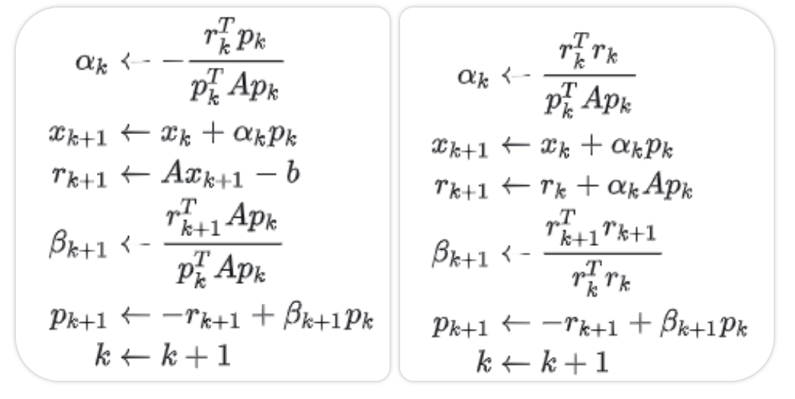

  上式的推导可以给出：

  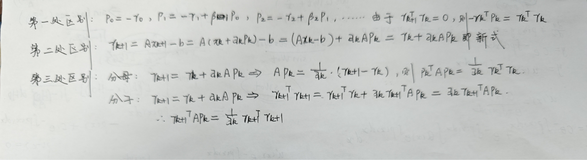

  CGLS和CG的关联如下，这样引入额外辅助向量的目的就是避免M(即A的共轭转置乘上A的矩阵乘法这样的复杂运算)的出现：

  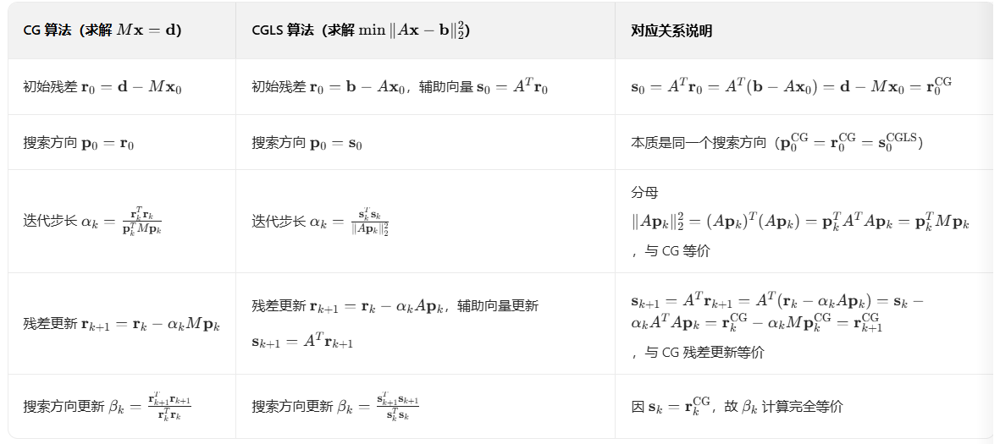

  这里我们在MPI的正问题中引入了权重矩阵和正则化项，可以在最小二乘法的系统矩阵构建中将上述部分考虑进去，改写后的最终系统矩阵满足列满秩的特点，此时也需要对CGLS做一定的改写(推导可以结合2012综述中对系统矩阵的改写+CGLS的步骤)(下面的第一张图是MPI中的CGNR算法步骤，这张图中的A莫名其妙，其实就是S，第二张图是MPI步骤和CGLS标准步骤的对比证明)：

  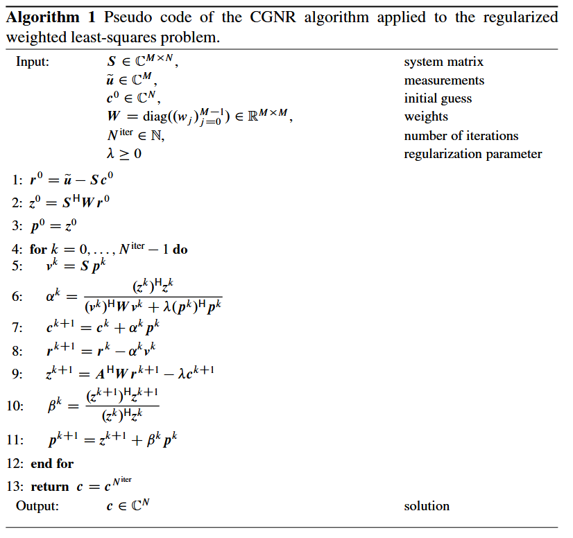

  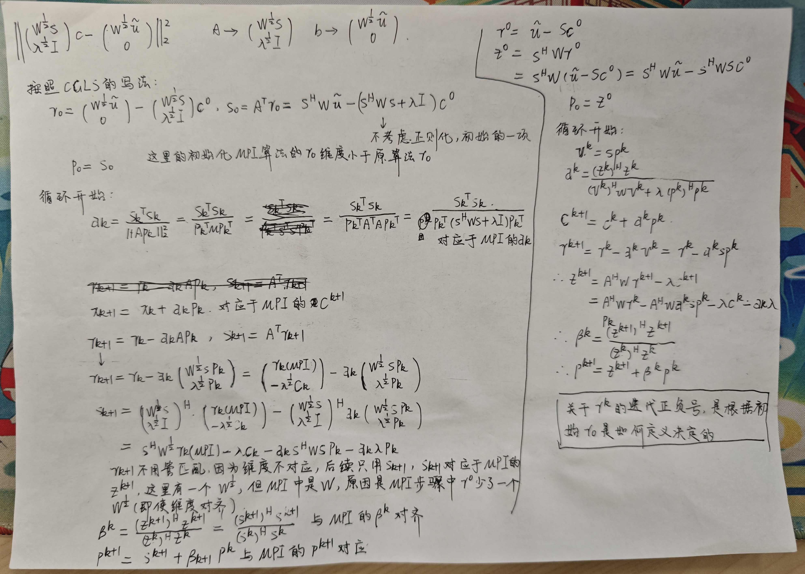

  **值得说明的是，上述公式中的初步残差向量r的定义是去除正则化项+去除权重矩阵的平方根部分得到的，去除平方根会在每一步计算对应的z的时候补足，不会影响和原始CGLS的结果区别，但我认为一个改进点在于应该将正则化考虑进去，理由在于后续关于CG的计算优化的三步都是建立在初始方向是最速下降中梯度的反向才能得到的，后续会在自己的代码中改正**

  CGLS在文章中有两个特性，这里我们不加以证明，只说明细节即可：1. 如果CGNR算法的初始浓度为0，则仅需一次迭代就能获得比较好的效果，Knopp组之前在MRI中的工作说明了这一点，当系统矩阵行(各频率分量)垂直时，下面的一步迭代结果就是正则化+权重矩阵引入的最小二乘法结果，当频率分量近似垂直时，一步迭代结果也是真实解的良好近似；2. CGNR算法的收敛速度和引入权重矩阵的
  $S^{H}WS$的条件数相关，因此希望权重矩阵引入后的系统矩阵拥有行垂直的特性，这有助于算法的快速收敛

  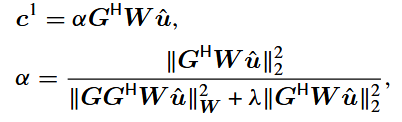

  **第二种常见算法是Kaczmarz算法**，CT中常将其称为ART算法。Kac的算法思想其实很简单，就是以系统矩阵的行作为迭代的基本单位，每次在原来浓度的基础上增加一个距离下一个频率分量的子空间最近的空间变化量，下图是Kac的核心迭代公式，左图是实数域的ART，右图是MPI中复数域的ART，**区别在于切换到复数域时ART的每步迭代方向也变成了系统矩阵行的共轭**：

  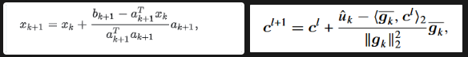

  MPI中对Kac的改进在于对于MPI的数据保真项那样的原始系统矩阵，无法保证确实有解，这被称为非一致系统，无解的情况Kac会在一个范围内振荡更新，因此做出的改进是将系统矩阵改写，具体如下，这样改写的系统矩阵满足行满秩的特性，线性方程组保证有解：

  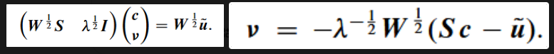

  有了上面的核心迭代过程，MPI中的Kac的伪代码如下(推导很容易，改写系统矩阵的效果在某种程度上等同于对重建问题做了正则化处理)：

  

  实验细节：使用的'Weizenecker J, Gleich B, Rahmer J, Dahnke H and Borgert J 2009 Three-dimensional real-time in vivo magnetic particle imaging Phys. Med. Biol.'这篇文章中的设备，本来有3D扫描功能但没用，系统矩阵大小为2536*2720，使用经典的斜'P'Phantom，文中展示了几个实验结果，一个是**前600行系统矩阵行的点积计算结果(共轭点乘，考虑了权重矩阵的参与，归一化处理)**，结果还是很令人满意，测量得到的系统矩阵拥有比较垂直的系统矩阵行效果，这里还对比了没有引入权重矩阵的点积结果，权重矩阵的加入会使结果好很多；一个是**引入权重矩阵的系统矩阵的奇异值计算**，归一化权重的加入能有效的增大较小的奇异值，使得矩阵的病态程度有所缓解；一个是通过SVD求解最小二乘法结果，对比的是不同的SNR阈值选择和不同的权重矩阵选择；一个是**通过Kac和CGNR两种迭代算法求解的SNR大于10的不同权重矩阵设置的重建结果对比**，使用归一化权重的方案在成像质量和成像速度上都有所提升，总的来说，Kaczmarz还是会优于CGNR。

* **#2017.1**  
  **tikhonov正则化 + 非负Kaczmarz + 权重矩阵 + SNR阈值筛选被认为是基于系统矩阵的SOTA重建方法，文章认为tikhonov过度平滑了图像结构边缘，因此提出使用NFL(nonnegative fused lasso model)的方式建模正问题，并为此设计了计算性能良好的重建算法，主要的特点是对TV正则项的二维、三维划分，以及在面对多个正则化项(非负正则化项+L1正则化项+TV正则化项)+数据保真项的正问题时如何使用优化算法对这个正则化项无法求导的优化问题进行求解(a generalized forward-backward scheme)，其实和ADMM是类似的，但没有使用增广拉格朗日+分解子问题的方式，而是分解正则化项+投影+加权平均各个正则化子问题的方式求解，看这篇文章的时候可以和ADMM的方法进行算法步骤思想上的对比，其实最终重建效果是相当的**，另外文章做的实验比较充分，有仿真的三个phantom，也有一个狭窄心血管介入的真实实验，在多帧之间模拟了血管内引入球囊导管的扩张效应，用tik+kac作为baseline对比了文章提出的方法的效果。

  tikhonov正则化允许使用CGLS或Kaczmarz进行重建，但很大的问题在于这个正则化过度平滑了结构边缘，考虑到一些类似型血管介入的对结构边缘的锐利度要求较高的场景，可以使用L1+TV的正则化建模，但与之对应的计算难度将会大大增加。对于丽萨荣轨迹的系统矩阵，依靠建模的方式基本很难将其还原的比较好，大多数情况还是采用校准测量；同时一些在笛卡尔轨迹上的成像，则会使用不依赖于正逆问题建模的一些即时SOTA算法(指的是X-Space方法这类)。

  简单来说，文章的主要贡献点在于针对TV正则项，使用了Potts priors的方式对TV进行了分解，权重的加入使得TV的求解保证了较好的各向同性(常规的在下方和右方求解的两个梯度绝对值之和无法保证各向同性，导致结构出现阶梯效应)；求解算法的部分，使用了generalized forward-backward scheme的方法，算法仅在求解梯度的部分需要一定的计算复杂度，相较于近似映射的计算效率更高，适合于稠密且无序的MPI系统矩阵，同时分解得到的近似映射又只有线性的复杂度，对于多帧延时重建，使用热启动策略，即使用上一帧的重建数据作为初始解，这依赖于MPI在多帧之间的数据变化不大。

  文章对tikhonov的正则化发展有一定的介绍：改进点就是引入了权重矩阵，权重矩阵的引入帮助提升图像质量，并且加快了收敛速率。基于tikhonov的正问题模型的弊端在于正则化项本身，因为L2的范数鼓励惩罚爆炸性增长的一些像素点，导致完全无法引入待重建区域的结构先验信息。另外，L2正则化可以看成是噪声是0均值的高斯分布，待重建数据也是0均值的高斯分布，根据贝叶斯公式计算最大后验概率时，可以将整个L2正则化的优化问题看成是MAP的数学表示，因此这个假定本身就是不正确的，这一假设本身也忽视了邻近像素点之间的信息。还有一个比较重要的观察就是在很多的MPI场景下，空白像素的个数要远大于非空白像素的个数，这意味着完全可以采用一个鼓励稀疏的正则项，因此考虑到上述观点，本文设计了NFL观测模型：

  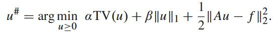

  一维情况下的TV和L1很好计算，因此不做赘述，文章在这里展示了基于最简单的TV计算方式得到的一维图像，公式如下：

  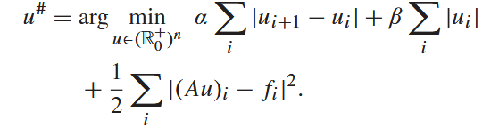

  如前面所说的，在多维情况中，再使用这类的TV展开方式就不合理了，原因在于只在两个方向上计算像素变化值具有各向异性，重建图像会出现阶梯状，因此采用**Potts priors**的思路分解TV，计算总计8个像素点的像素变化值，只在右方和下方进行变化的原因是如果只计算绝对值的情况下，通过顺序遍历的方式可以同时计算上方和左方的变化值，具体的二维计算方式如下：

  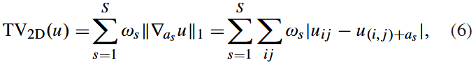
  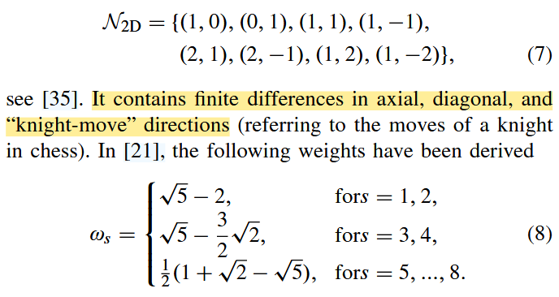

  在三维的情况下需要进行额外的权重计算，原因有二：第一，三维的选择像素点方式需要因为z方向的引入进行扩充；第二，三维情况的磁场需要满足无点源的条件，导致各个方向的梯度场梯度不一致，进而影响网格点在不同方向上的划分基本单位不同，如z方向的梯度场梯度是x和y的两倍，则单个网格点的z方向的长度就是x和y这两个方向的一半，因此需要基于不同的网格方向长度重新估计划分的每个变换值的权重，划分的规则如图：

  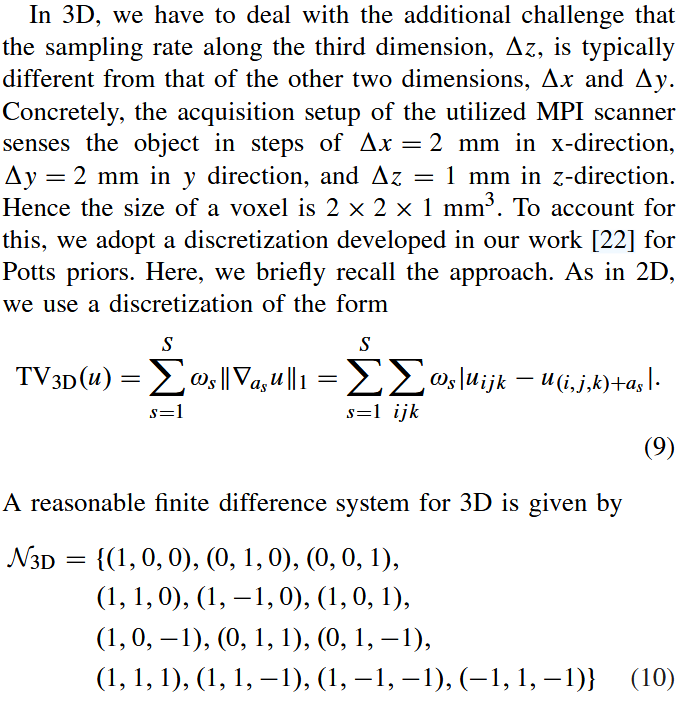
  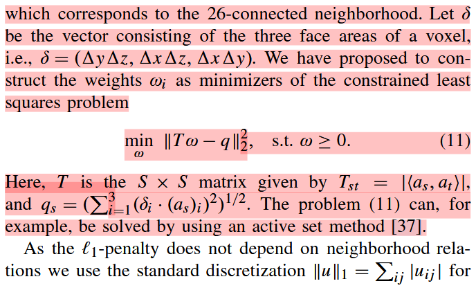
  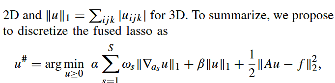

  解释一下上面的权重划分规则：**在三维的连续情况下，总计26个方向如果考虑反向的变化值在遍历像素点的情况已经计算，则可以归类为上图中的13个方向，三维情况时考虑单个方向的像素值变化率就需要考虑面效应，比方说如果x方向移动了1，则需要考虑
  $\Delta y * \Delta z$ 的面效应，因为实际的变化效应会发生在垂直于x轴的平面上，此时可以根据选择的13个方向的每一个计算影响的真实大小，即跨面的真实几何长度，这就是公式当中的q(13个方向排列成是一个向量)；而
  $T \omega$中的T是一个13*13的矩阵，计算的是每一个像素之间的点积，针对性的为每个被点积的方向乘上权重，则矩阵乘法计算得到的向量的第i个元素就是该方向的离散几何长度(如何去理解这样的计算方式：假设选取的方向具有普适性和可拓展性，和这13个方向的点积在一定程度上就能反应该方向在三维的真实情况下的效应，构建了一个线性方程组求解各个方向的权重)**

  得到具体的正问题公式后，需要考虑如何迭代优化，一个难点在于如果只有单个无法求梯度的正则化项，可以进行近似映射迭代计算，问题出现在多个正则化项中，需要想办法进行分离：**使用“A generalized forward-backward splitting”一文中的广义前向-后向分裂方法进行计算，在文中的改进是既然TV的方向有多个，按照方向将TV问题进行分解，同时将L1正则化项也平均分为13份，构建了多个分裂的正则化项，一次前向的通过梯度更新待重建数据的步骤后并行的维护14个变量(13个按方向分裂的正则化项+非负正则化项)，在更新的待重建数据的基础上进行近似映射，通过和上一次重建数据的差值引导每一个方向上的新变量更新，真正的待重建数据直接计算分裂的新变量的加权平均即可，一个需要从原理上理解的操作就是真正去更新新变量的重建数据是重建数据关于当前新变量的镜像对称**：

  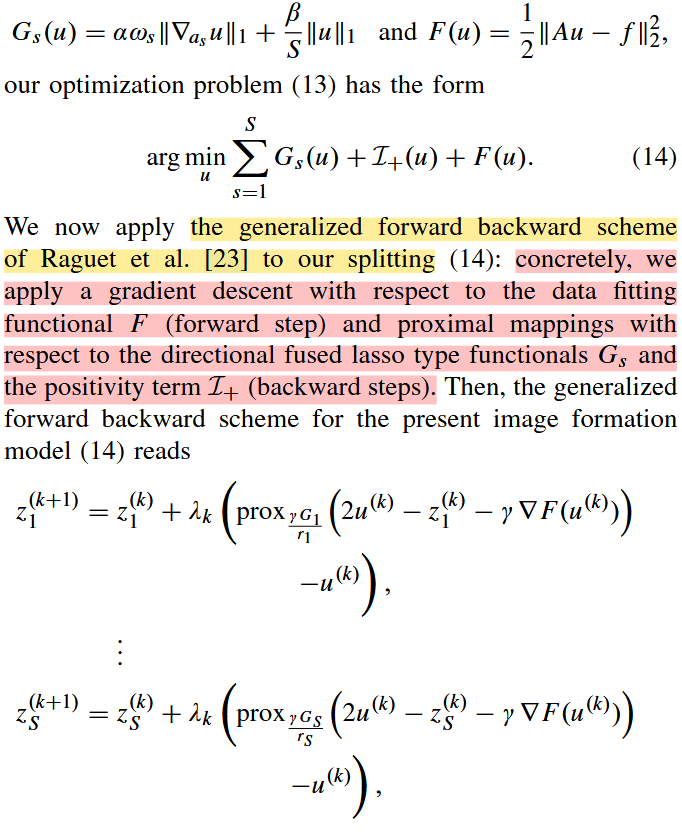
  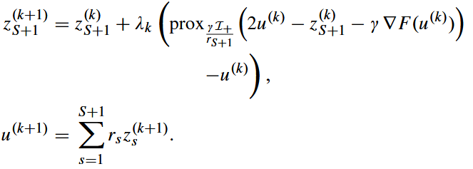

  由于TV只考虑单个方向，直接计算成多个行数据的近似映射，计算复杂度为线性，**上述公式中各个分裂项的更新步长和梯度的更新步长和函数的利普西茨常数有关，文章中一般将所有的分裂项的权重设为相等，分裂项的更新步长设为1**，整体的算法计算分析和过程如下：

  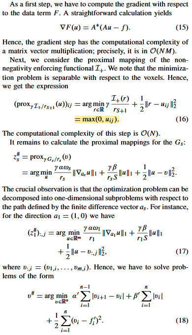
  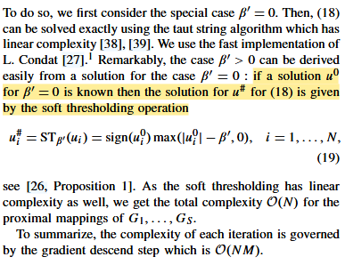
  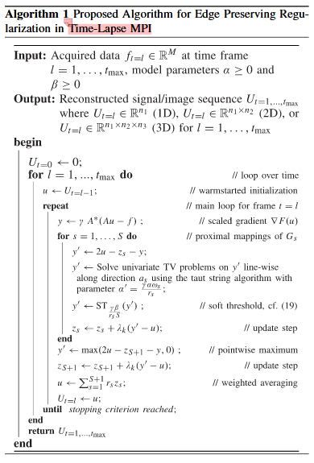

  计算L1+TV的分方向近似映射是通过软阈值解决的，假定不受L1的影响计算得到一个初始解，然后套用软阈值函数；伪代码中的时间信号指的是帧与帧之间，单帧仍然包含至少一个整周期信号，因为文章的瞄向是心血管介入中球囊导管引入的前后变化，因此需要重建时域信号。

  一个很重要的点：**此重建算法是可以高度并行的，算梯度的矩阵乘法可以分解，映射可以分方向并行，对于多帧延时重建，使用热启动策略，即使用上一帧的重建数据作为初始解，这依赖于MPI在多帧之间的数据变化不大**。

  实验不说了，比较充分，有一维、二维的仿真对比实验，只打tikhonov+kaczmarz，有三维的心血管介入实验，重建了三维的渲染结果和二维切片结果，效果很好，重点的训练策略可以和ADMM进行对比学习。

* **# 2020.1**  
  这篇文章有github仓库：[https://github.com/Ivo-B/3dSMRnet](https://github.com/Ivo-B/3dSMRnet)

  文章需要解决的问题是减少系统矩阵的测量校准时间，基本思路是在FOV的网格节点中选择一个子集对系统矩阵进行采样然后使用网络对系统矩阵进行完整的恢复，基于这个思路，自然和前面基于压缩感知的方式需要进行对比，文章的实验部分在OpenMPI中进行，因此在三维情况下每个维度以0.25的采样率最终的系统矩阵大小就会减小64倍，因此可以做到比压缩感知小很多的压缩率，最终通过还原得到的系统矩阵进行重建的结果也达到比较满意的程度。

  文章中提到按照超分的方式解决系统矩阵的欠采样+还原问题，因此将方法定位在了SRGAN和SRCNN这两类方法中，GAN当然可以通过CNN实现，但这两类超分的实现方法更本质的区别在于SRCNN是回归型的超分结构，而SRGAN是生成型的超分结构，更本质的说法就是CNN通过构建MSE之类的损失函数完成回归任务，让像素级别的信息更贴近真实信息，侧重于图像整体的平滑还原；而GAN之类的方式引入了感知损失等，使得超分的图像更符合人的感观，但文章中这里认为如果在重建的时候能提供一定的先验信息，SRCNN之类的方式是更适合系统矩阵的还原任务的，因此大框架确定。

  文章总体的工作流程如下：

  

  橙色的工作流程就是正常的采集高分辨率的系统矩阵之后进行线性问题的求解；蓝色的流程就是3d-SMRnet推荐的采集方式，间隔性的规律性采集网格节点信息，之后通过网络进行还原，还原到与高分辨率系统矩阵同样的大小，之后再进行重建。

  因此工作的重心就是三个：**如何选择下采样系统矩阵的方案；如何将系统矩阵的复数值转换成网络能够处理具有一定特征的数值；如何设计良好的超分网络完成这个任务**

  文章中很重要的一句话是：**文中将系统矩阵的行看成是独立无关的单张图象，因此可以针对单行做超分任务**，如果我在单行中进行三维卷积，就可以将其看成是单张三维图像的内部处理，这样就定义了超分任务的具体实现方式，但一个很重要的点其实是：**如果没有利用系统矩阵行之间的相关信息，这个系统矩阵的超分学习的模式其实不是那么domain specific，这也是后面一些文章攻击他的地方，还有一个在后续文章中被攻击的点就是单一CNN结构，可能采取混合架构效果会更好**。下面按照上面分析的三个重心来说明一下具体的一些操作：首先下采样通过规律采样，即在高分辨率系统矩阵中按照规则间隔几个像素点采样一个的方式进行下采样，可以根据前面的示意图来查看具体的操作，后续在比如3倍等的非整除周期内，就可以重新划分网格+填充0像素网格稍微扩大FOV的方式来进行；复数到网络中的转换通过RGB encoding的方式，首先每个位置的复数包含一个幅角，当饱和度和亮度设为1时，对应的一个幅角就可以在HSV色系中获得一个纯色，此时再通过HSV色系和RGB色系的转换关系将单行系统矩阵转换为三维的RGB图像，解码部分提取RGB的幅值(编码部分进行编码，这部分可以具体看代码的实现流程)，进行归一化后再转换得到HSV色域值；网络部分借鉴了ESRGAN中一个很经典的结构-RRDBs(Residual-In-Residual-Dense-Blocks)，其实比起之前超分中常用的RDN就是将RDB的连接方式由稠密连接改成了残差连接，设置了一个残差的权重系数。网络的特征提取部分由9个RRDBs组成，每个模块中有三个稠密连接的blocks和四个稠密连接，单个block中有五个卷积；上采样部分使用最近邻插值上采样+解卷积缓解棋盘效应，按照缩放比例的不同设置一层或两层的图像恢复层。

  OpenMPI数据集中有两种磁粒子的采集信号，因此文章中在Synomag-D上训练，惊奇的发现在Perimag上的系统矩阵也能起到还原的效果，因此文章说自己有一定的跨粒子适应能力，同时这也说明了学习到的系统矩阵超分模式不是一个过拟合的现象。

  文章中针对OpenMPI数据集数据不足的情况通过90度旋转和随机翻转的方式进行数据增强训练，设计了3个上采样网络，即8倍、27倍、64倍，其中SNR的阈值设置为3，一些具体的实验细节可以看文章中，和压缩感知的对比主要是在大幅度减小系统矩阵规模时，此时通过超分实现的系统矩阵在系统矩阵质量和重建质量上都要好于高倍率的压缩感知。
  
  

  

  

  
  

  

  
  
    

  
