| Paper Name | Year | Publication Venue | Author(1st & Corr.) | Short Summary | Item Number | 
|------|------|------|------|------|------|
| Enhanced reconstruction in magnetic particle imaging by whitening and randomized SVD approximation | 2019 | Physics in Medicine & Biology | Tobias Kluth，Bangti Jin | 矩阵白化+对系统矩阵SVD分解实现重建质量和速度的双向提升，白化看成是权重矩阵的升级，实际上很难实现，SVD分解是对矩阵压缩的一个很好对比，目的是为了减小矩阵行 | Tobias Kluth 2019.1 | 
| Model-Based Reconstruction for Magnetic Particle Imaging in 2D and 3D | 2016 | Inverse Problems | März Thomas, Weinmann Andreas | 建立了一种新的MPI多维重建范式，构建了一个core operator | Thomas 2016.1 |

* **#Thomas 2016.1**
  Inverse problems2016上的文章，主旨是**通过作者在前向算子中提取到的core operator求秩在核心算子和粒子浓度之间建立标准卷积运算，重建算法核心是在n维下单个体素至少扫描n次，建立满秩矩阵计算得到对应phase space的核心算子，再进行反卷积操作(实际上也是通过计算loss极值，建立线性公式通过共轭梯度求解)**，这篇文章的推导内容非常多，解读中不会展示所有的证明过程，只展示主要部分。

  MPI中通常使用前向算子来描述测量信号和粒子浓度之间的关系(即系统矩阵)，一般获取前向算子的方法可以分为基于测量和基于建模两种，文章可以归类为基于建模的方式，因此主要分析基于建模的方法，本文将众多的基于建模方法分为几类：Rahmer等人在2009年那篇分析系统函数的文章将系统函数描述为第二类切比雪夫多项式的线性加和(理想情况下)，这个结论在二维、三维情况下无法满足；Goodwill将时域信号映射到具体的位置浓度，即X-Space，这一方法的重点在于FFP的位置由驱动场唯一确定。前面的这两种方法其实最终都将信号生成过程描述为卷积操作，这里还提到了一篇文章"H. Schomberg. Magnetic particle imaging: model and reconstruction. In 2010 IEEE International Symposium on Biomedical Imaging: From Nano to Macro, pages 992–995, 2010."这篇文章得到的卷积核是一个向量，总体的思路与前面的差不多。文章认为前面的方法在二维三维情况下没有完整准确的重建算法原因在于多维情况下的卷积核呈现出矩阵形式，这会破坏现成的一些假想结论，此外，之前的基于建模的方法未能将重建和扫描轨迹解耦，虽然声称可以使用任意的扫描轨迹(还是主要围绕基于FFP的情况)。

  文章的主要内容包括：**在不同维度中核心算子的推导；多维情况下的重建公式；多维情况下的重建算法**，核心算子体现在相位空间(phase space)，相位空间的优点在于不受任何轨迹概念的影响。

  基本的推导不展示了，这里从多维的信号公式回顾开始，下面的图中主要展示的是如何拆解驱动场和梯度场，并将整体磁场写入信号公式中：

  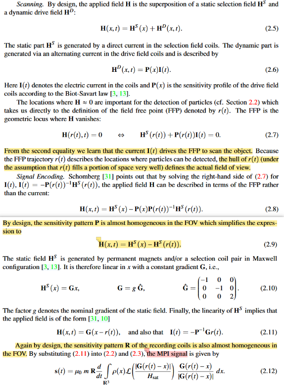

  上述的信号公式中整体的信号与具体的扫描轨迹挂钩，某一时刻的FFP位置决定了此时刻的电压信号，下面是核心算子的引入：

  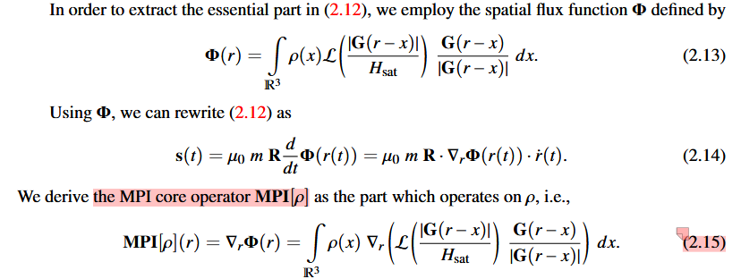

  为什么要设置这样一个核心算子，可以稍加分析：**如果按照核心算子分离信号公式，最终的信号可以表示为一个空间灵敏度的卷积乘上FFP的速度，核心算子是一个卷积核为矩阵、作用函数为粒子浓度的卷积操作，真正的因变量只有当前时刻的FFP位置，这部分和具体的FFP轨迹无关，只是一个简单的空间积分，与FFP轨迹有关的其实就是FFP的速度，但这部分我们通过链式求导法则将其分离出去了，其实如果最后你看那个核心算子的公式，这和多维X-Space的公式非常接近，甚至就是一样的，同样将FFP速度分离出来，只不过多维X-Space方法的分解方式是通过不同的方向(平行和法向)**。

  文章这里为了简化整体的表达，分离一切无关与核心计算的部分，引入了一个无维度的参数
  $h$描述空间分辨率，当h更小时，空间分辨率更好，h可以整合所有会影响空间分辨率的变量，如梯度场梯度、成像空间大小、中心磁化饱和强度等等，同时根据一些常规的磁场参数，可以计算出h的大小接近0.01，此时将一些变量归一化后可以重新构建核心算子：

  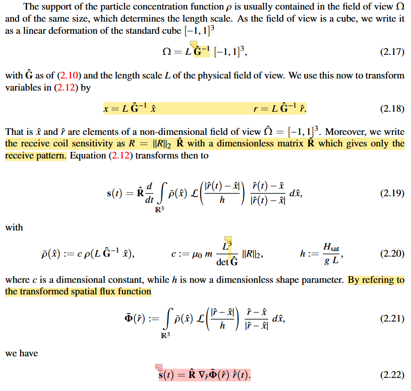

  上述公式中核心算子还是粒子浓度的卷积操作，卷积结果的空间分辨率可以根据卷积核的形状和FWHM确定，因此h是决定空间分辨率的关键，在这里有一个比较重要的分析：**我们根据一系列的常规参数可以计算出
  $\beta和h$的取值大致落在什么范围内，如果我取粒子直径为25*10^{-9}m，\beta大约是87，h大约是0.001，因为两个超参数都是影响朗之万函数的具体走势的系数，所以h能很明显地将朗之万曲线的动态范围拉的很小，这样就有利于重建质量的提高**；在这段推导之后，文章还包括了对此时电流幅值、FFP归一化位置和电流归一化向量的关系、以三维的视角重构一维和二维的信号公式，细节可以再看原文。

  从核心函数入手，开始后续的分析，这里的**推导从归一化的信号方程开始，将一些\hat和\bar的符号去除，另外线圈灵敏度R在信号公式中不是很重要，因此省去一切和粒子浓度无关的部分**，这里有一个在推导之前的结论比较重要，即**既然核心算子与具体的扫描轨迹无关，完全可以通过多次设计不同的扫描轨迹来更好的拟合精确的核心算子**：

  

  下面的推导根据两种情况，第一种是当h趋近于0的情况，多维情况下核心算子内的卷积核是一个非标准的矩阵形式，一个很重要的突破点是**核心算子的迹即包含了粒子浓度的所有信息**，如果在计算迹的情况下，就能将多维情况下的核心算子卷积转换为标准的标量卷积操作，具体的推导结果如下：

  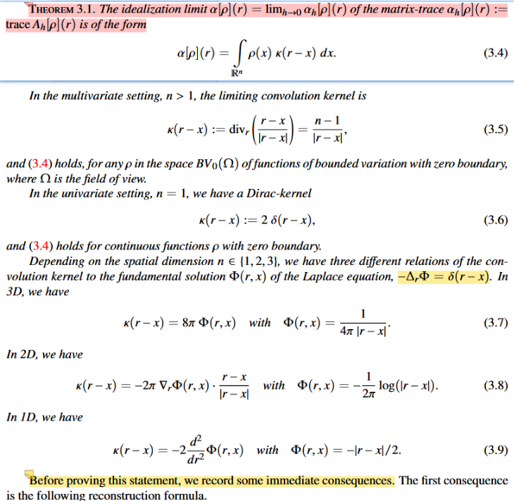

  上面的推导过程不详细展开，具体可参照zotero附件中关于散度计算的推导和文章中12页的推导内容，另外上图中将核心算子的迹中的卷积核和不同维度的拉普拉斯方程的基础解相互关联，在上图中的推导成立的基础上，可以得到两个推论结果，证明过程比较简单不多赘述，第一个推论结果是：**既然卷积核已知，如果能计算得到核心算子的迹+解卷积，就可以得到粒子浓度**，第二个推论结果是：**即使在h趋近于0的情况下，在二维和三维的场景中重建问题也是病态的**，此推论通过拉普拉斯基础解和多维情况的卷积核之间的关系证明。

  在得到趋近于0的情况下的结果后，可以接着分析当h>0的时候卷积核会如何变化，具体的结论如下：

  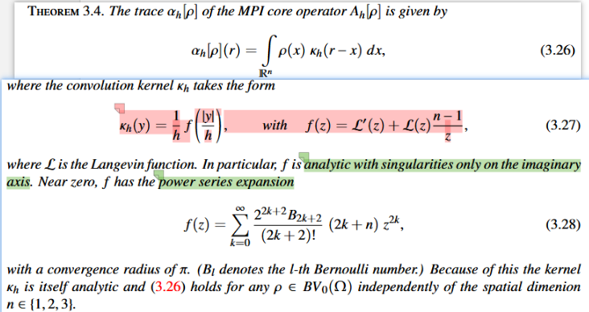

  上面的推导过程可以参照文章16页的证明过程，主要介绍一下有此结论的一些推论：第一个结论是：**既然卷积核已知，如果能计算得到核心算子的迹+解卷积，就可以得到粒子浓度**，第二个结论是：**理想情况下的卷积核和一般情况下的卷积核之间是可以相互转换的，证明思路就是在一般情况下的卷积核中考虑h趋近于0的极限值**，在第二个结论的基础上进一步推导，可以得到**一般情况卷积核就是理想卷积核的卷积结果，卷积核是一般情况的卷积核的拉普拉斯算子结果**，证明详见文章15页的推导，第三个结论是：**在一般情况下，核心算子的迹会更加病态**，证明方式是通过空间同构说明，首先非理想化的卷积核是解析的，且空间同构映射具有闭像，但非理想化的迹对任何的密度函数也是解析的，这不满足闭像的要求

  在分析完核心算子后，可以构建重建公式和重建算法，核心算子处在空间域，计算的是每个FFP位置的信号值，因此需要完成从离散时间信号到核心算子的转换。这里我详细说明一下离散化的操作：**我们之前提到本身核心算子是一个建立在空间域的卷积操作，算子和具体的扫描轨迹无关，我们拿二维情况举例，核心算子会计算得到一个2*2的矩阵，如果我们希望获得更精确的核心算子值，我们的一个想法就是希望在每一个扫描周期中，每一个网格点都会至少从两个不同的方向被经过，这样我们就可以建立起一个方程组，想象A是核心算子，形状为2 * 2,V是整个周期中出现的经过i这个网格点的不同速度，行数为速度的维度即2，列数为速度的个数，对应于S有多个电压信号，如果这样计算很明显的一个结果是电压信号也是一个矩阵，考虑如果加上线圈灵敏度的点积结果，就符合正常的电压信号的维度**，关系如下，下面的内容中还包括了如何求解得到某个网格点的核心算子和核心算子的迹：

  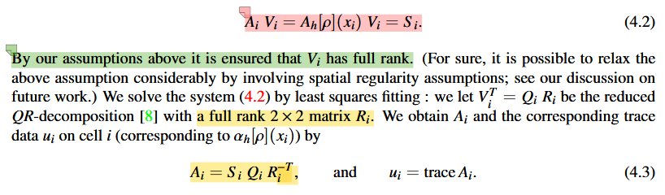

  **在得到核心算子的迹之后，就是需要在一般情况下解卷积，由于核心算子具有较强的病态程度，因此在解卷积时使用正则化的方法求解**，这里**通过离散化将卷积操作转换为一个矩阵乘法操作，通过前向有限差分算子构建了矩阵D，其实可以通过中心差分进一步缩小误差，这个最小二乘法问题通过Euler-Lagrange equation+CG迭代解决**：

  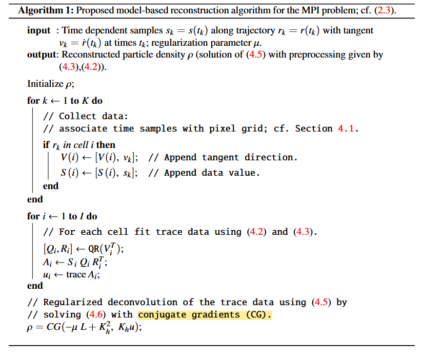
  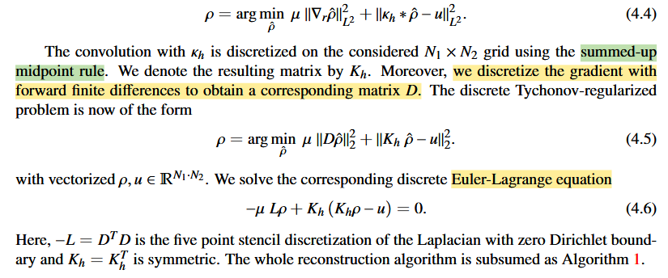

  实验结果不细说，主要说一下实验的一些设置，通过仿真电流施加二维丽萨荣轨迹，比例为101：102，网格大小为100*100，从0-1的时间间隔中采样了200000个时间点信号，最终测量得到的信号施加了0.1的噪声比例，通过计算时域信号中最大的信号强度进行等比例缩放，CG算法通过Octave library中的封装CG实现，相对容差为
$ 2 * 10^{-3}$
  
  **总结：主要是一种对标X-Space方法和拉东变换等重建方法的分析算法，为什么这么分类呢：其实上述的三种，都未涉及频域的转换，都是在时域将时间节点的信号直接映射到具体的某一个区域内；作者认为前面的分析法有两个巨大的问题：重建算法无法与扫描轨迹高度解耦；在多维情况下没有和低维一样有效且简洁的类似标准卷积的前向算子；因此作者分析了MPI正问题，提出了一个core operator，核心算子建立在'phase space'上，完全与扫描轨迹脱钩，多维情况下通过求核心算子的迹将矩阵核转换为标准卷积核，重建算法核心是在n维下单个体素至少扫描n次，建立满秩矩阵计算得到对应phase space的核心算子，再进行反卷积操作(实际上也是通过计算loss极值，建立线性公式通过共轭梯度求解)**。

* **#Tobias Kluth 2019.1**  
  **本文的重点是矩阵白化+rSVD实现传统算法的重建质量和速度提升：白化的目的在于将测量噪声的协方差矩阵转换为标准矩阵形式，以满足最小二乘法的基础假设；rSVD的目的在于将系统矩阵的维度减小，Kacmarz算法的迭代速度和矩阵的行数线性挂钩，rSVD针对MPI的系统矩阵具有病态低秩的特点，特定地减小矩阵的行数以提升算法速度**。

  文章中提到了目前在MPI重建中基于校准测量的系统矩阵方法仍是主流，提及在时域直接定位到指定区域的粒子浓度的方法称为model based approach，这个说法不通用，不是指通过建模构建系统矩阵的方法，文章中指的是X-Space方法、基于切比雪夫多项式的加权和、2016年核心算子方法和拉东变换方法等等。基于系统矩阵的线性重建也需要构建数学模型，也有不通过tikhonov的正则化，例如L1+TV等，但大多数都受制于**系统矩阵中的数据维度越大，重建算法的执行速度也越慢**的特点。

  重建算法的加速主要可以分为两个方向：一个是寻找在预定义基集上的稀疏表达，构建稀疏表达后可以使用CGNE或LSQR等方法，稀疏表示同时可以做到提升重建速度+减小存储空间；另一个是直接通过SNR阈值等方式减少系统矩阵行数。

  文章中描述工作的贡献在于解决了MPI重建的两个问题：**保真项的选择(即重建公式的选取，最小二乘法的优化目标)和算法加速**，结果显示白化的操作可以提升重建质量，rSVD对系统矩阵的处理可以使算法速度提升十倍以上。

  文章中对于MPI的正问题有自己的一套描述方式，主要参照下面的这几张图：

  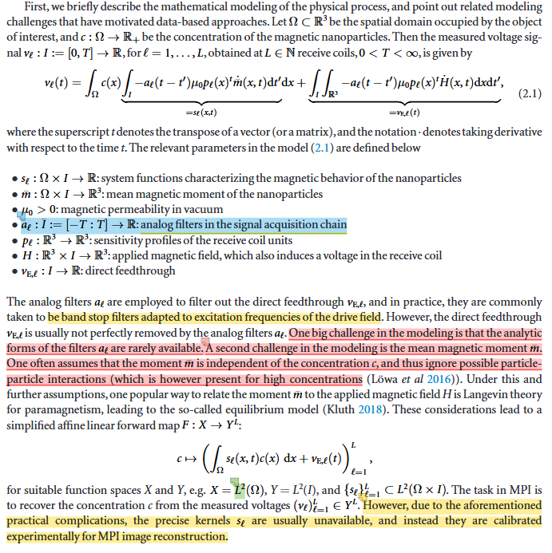

  第一张图中需要说明的就是在正问题中考虑了滤波的效应，输入信号和输出信号在滤波的过程中呈现出卷积效应；建模写出精确的系统函数两个难点是：滤波函数很难精准测定、平均磁化在上述公式中被认为是和粒子浓度无关的部分，但实际上粒子的多少决定着粒子相互影响的大小，从而间接影响了平均磁化量，这里甚至都不需要考虑用朗之万函数描述磁化曲线拟合程度很低、需要考虑弛豫等问题；建立在上述分析基础上，精准地建模在任何精度下的系统函数称为一个很难实现的问题，因此只能采用**离散化校准测量**的方式获取系统函数。

  对离散化系统矩阵的获取描述如下：

  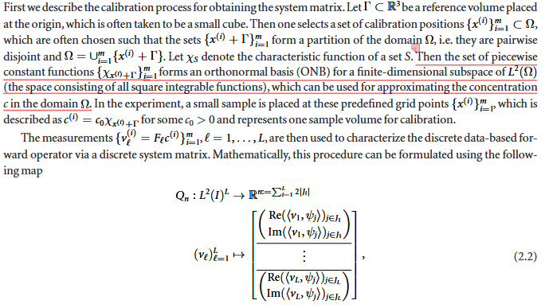
  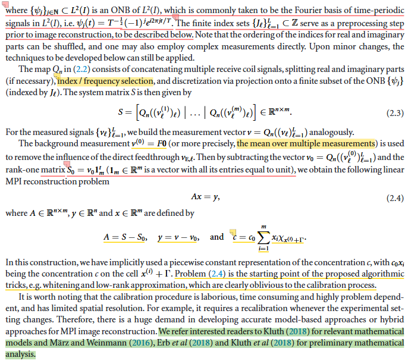

  上面两张图中描述了离散化系统矩阵的获取过程，首先是测量位置的选定，在FOV中通过ONB选择了共计m个空间点，这里的特征函数可以理解为不在这个区域为0在这个区域为1的函数，用于作为一个正交基表明delta sample出现的位置；然后就是
  $Q_n$这个映射函数，表明的是在L个信号频道中的时域信号可以同时转换为在频域上表达的信号，这里其实不光是在频域上对信号做傅里叶变换，构成的矩阵按照实部虚部尽心分离、在每个频道中单独寻找SNR阈值和滤波筛选确定频率分量范围
  $J_l$，按照这里的表述，在不同信道中的频率选择是不一样的，但不同的delta sample的频率选择一定是一样的，因为他会按照公式2.3一样按列组成系统矩阵，因为校准测量和实际测量中都有存在直流馈通的部分，因此需要在这些测量中都需要减掉，这个空腔信号需要经过多次测量求平均得到，即上面的
  $v^{(0)}$，由于空腔信号我们认为等于0浓度的向量乘上前向算子得到的结果，因此各个位置的空腔信号相等，则可以用
  $v_0 = Q_n\left( \left( v_\ell^{(0)} \right)_{\ell=1}^L \right)$和
  $S_0 = v_0 \mathbf{1}_m^t$，后面的这个公式即意味着对空腔信号进行列扩充，将其从一个向量扩充到各列相等的矩阵，目的就是对应于当前的总测量信号得到的系统矩阵，经过前面的分析后，可以直接在测量信号和系统矩阵中去除掉直流反馈的部分，最终就能得到基于系统矩阵的MPI正问题公式，这里的浓度**c**有一个基于单位
  $c_0$，原因是校准测量的delta sample有一个
  $c_0$的浓度，因此可以看成是和delta sample浓度的比例关系，可以做归一化，也可以不做。

  前面的分析中提到了每个信号频道分量可以单独选择频率，其主要手段就是SNR阈值筛选和滤波去除无关信号，这点在Knopp 2010年关于传统迭代算法的总结的文章中就已经有所涉及，这里有所不同的地方在于：**前面关于SNR的计算是针对于频域信号而言的，单独计算单个频率下的功率谱密度来衡量单个频率下的SNR值，
  $J_{BP}$表示滤波器在设置了上下界之后针对性的对一个范围内进行保留，在这个范围外的频率信号都被去除，这里的SNR计算相比起几年前的SNR计算要更为复杂，首先仍然是频域计算，但是是直接显式地将每个测量位置的傅里叶变换写入了SNR计算公式中，
  $\mu_l$的引入是为了统计在多次空腔信号测量时的误差，采用一个凸加权的方式计算单次校准测量前后的空腔信号到底是多少，这里需要想象整个FOV的校准测量的空腔测量不是一下子完成的，而是间隔几次校准测量了就测一次，因为空腔随时还会和时间等因素有关，出现在分子的部分就是去除直流馈通，分母也是一样，去除直流馈通才是真正的纯噪声信号**，经过SNR阈值筛选+滤波，才能得到每个信道最终选择的频率有哪些，构成最后的
  $J_l$：

  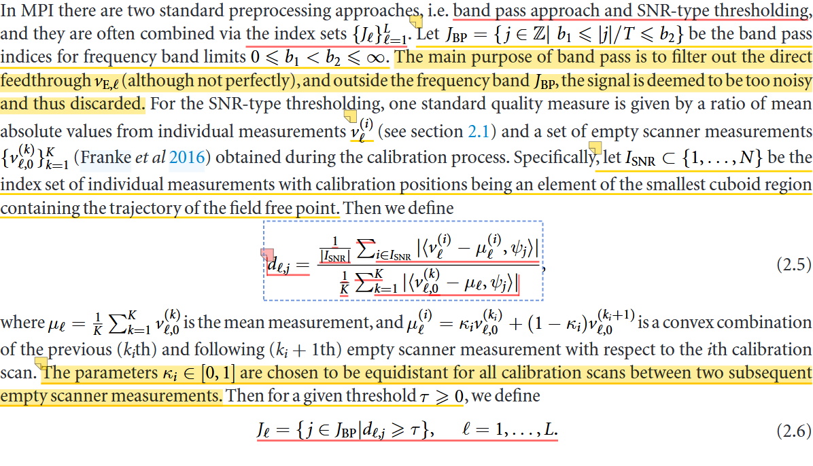

  来到本文的重点，即**白化**和**rSVD分解系统矩阵**，白化的一个基本假设是：**测量信号中包含着真实的测量部分，也有一个噪声，这个噪声的分布是无法控制的，但我们一般的优化方法都是通过最小二乘法作为损失函数来计算最终的浓度信息，这其中就天然的拥有一个鸿沟，即噪声并不符合MSE的假设，服从一个各频率独立且相同的高斯分布，因此白化的最终目的就是去调整噪声的分布，需要通过对噪声建模来将噪声转换成符合MSE假设的情况，在经过多次测量得到空腔信号之后，在测量信号中减去空腔信号，我们可以认为这个时候的噪声的均值为0，剩下的就是对一个均值为0，协方差矩阵为C的噪声进行处理，文章中想到了根据噪声的协方差矩阵设计矩阵W来进行调节**，具体来说，文章中针对原协方差矩阵C进行特征分解或是Cholesky分解，然后构建对应的W，此时的最小二乘法公式类似于加权的最小二乘法结果，可以想象为白化的操作就是进一步考虑了各频率之间的相关性的权重调节：

  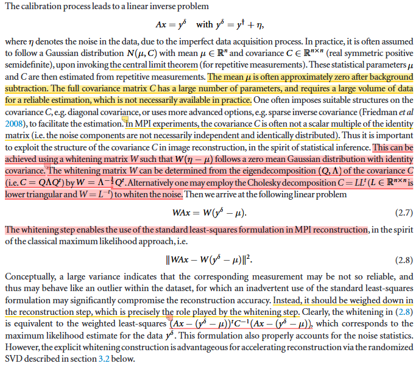

  这里还有一个很重要的点在于：**校准测量的过程中会引入model errors**，如下图所示，单个位置的校准测量也遵循噪声的原始分布，在多次测量空腔信号后可以消除均值，但当套上正问题的框架计算A x之后，就会引入多个位置的不同的方差项，使得最终的噪声分布变成与x相关，一般来说，在考虑噪声的分布中，我们会将校准测量的噪声和真实测量的噪声放在一起考虑，这样会让考虑model errors时的测量噪声也与粒子浓度相关，使得噪声的处理变得更为复杂，但一般情况下，在后续的正问题计算过程中，我们会人为的去除掉model errors的影响。

  如果将正问题建模为数据保真项+L2范数的形式，可以通过CGNR和Kaczmarz等迭代算法进行求解，这个过程中需要对这两种迭代算法有所更改以适应MPI的重建要求，通常情况下Kaczmarz的应用范围更广，原因是单次迭代只需要考虑一个线性问题，这和系统矩阵的整体规模有多大没有关系，因此保证了单次循环的线性复杂度，下图给出了改进后的Kaczmarz算法伪代码：

  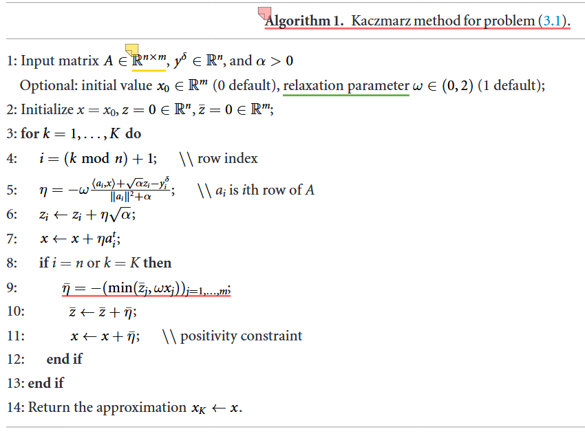

  **进一步改进Kaczmarz算法的一点就在于迭代速度，实现的途径就是进行SVD分解，传统的算法在文章中也有提及，但最终的落脚点还是针对于极大的系统矩规模传统的SVD分解方法并不高效，起不到减少计算量的作用，因此思考的方向转变为了"Finding structure with randomness: probabilistic algorithms for constructing approximate matrix decompositions"这篇文章中提到的随机数值线性代数(RandNLA)的一个重要方向rSVD,大致思路就是通过随机矩阵对系统矩阵的列空间进行采样(衰减较快时可能需要增强采样)，然后对采样结果进行QR分解，在一个小尺度上合成一个矩阵，计算小矩阵的SVD分解，之后再通过一定的方式进行截断，获得原系统矩阵的SVD分解结果；做SVD的核心就在于如果将左乘矩阵的转置再左乘到原正问题中，系统矩阵的维度一下子就能变小很多(病态矩阵可以在实验部分观察前多少个奇异值就占据了大部分的能量，有缩小矩阵的潜力)**，下图展示了rSVD的伪代码和正问题转变思路：

  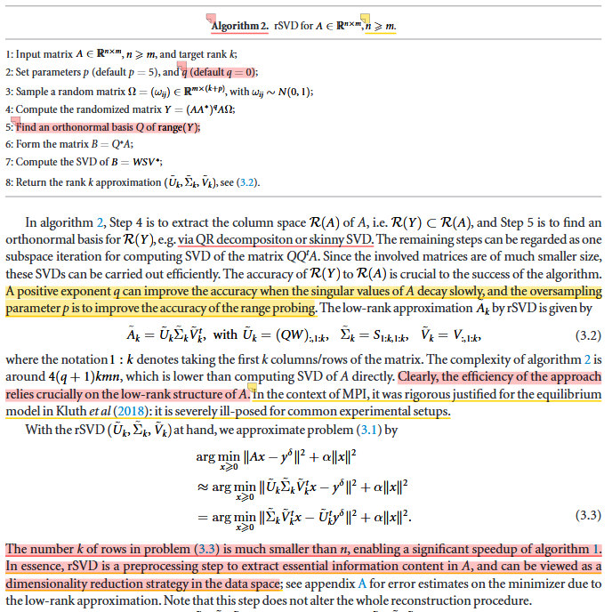

  关于实验细节和结果的一些展开：**系统矩阵和测量信号同时除了一个系统矩阵的F范数**；**使用了标准算法、SNR筛选的标准算法、rSVD分解后的加速算法、通过构建显式解+rSVD的一步求解算法**四种对比方式，具体可以参照文章中的内容；重建在Open MPI dataset中进行，Open MPI数据集当中提供了校准测量和真实测量时的空腔信号，并且符合间断测量+多次取平均的特点；文章中通过Picard plot分析了奇异值的分布和噪声的程度(通过谱密度反映)。这篇文章的实验部分挺多的，具体可以参见文章。

  
  

  

  

  

  

    

