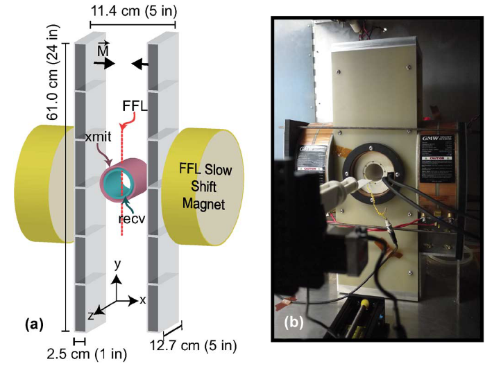
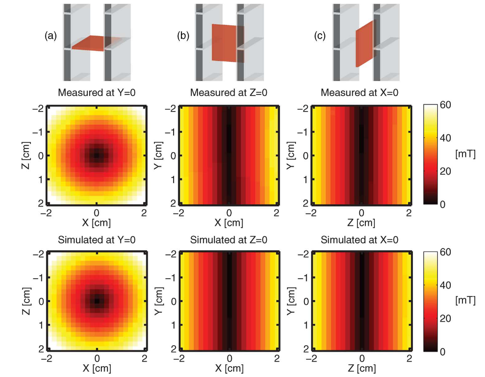
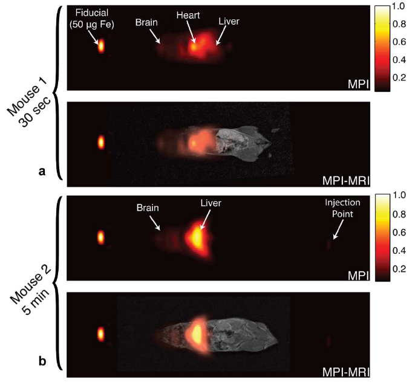

| Paper Name | Year | Publication Venue | Author(1st & Corr.) | Short Summary | Item Number | 
|------|------|------|------|------|------|
| Projection X-Space Magnetic Particle Imaging | 2012 | TMI | PW Goodwill, SM Conolly | 投影成像+X-Space+设备搭建 | 2012.1 |

* **#2012.1**  
  **这篇文章在2012年使用投影成像+X-Space的方法达成了SOTA的性能，基于FFL X-Space成像的基础对三维中的一个方向进行投影，围绕这样的思路证明了成像原理、设备设计和实验验证。**

  文章认为在三维成像中，只在两个维度即一个平面内进行FFL的移动，将大大缩短三维体积内的扫描时间，这是投影式MPI成像的优势。

  **理论证明**：在三维的场景下构建y方向上梯度为0的磁场，FFL在x-z平面上的投影就变成了一个点，此时如果在x-z平面上移动FFL和在x-z平面上移动一个FFP是类似的，这样就能将FFL的位置应用到X-Space方法中，这篇文章不给出具体的证明，实际就是在y方向上梯度为0的情况下将三维梯度矩阵转换为二维可逆的梯度矩阵，X-Space的信号方程和图像方程仅需改写梯度场的部分，其余都和多维X-Space一样。

  FFL的均一性(即FFL线上的整个线状区域都需要满足梯度场为0的性质)在很大程度上决定了X-Space重建的质量，FFL的非均一化会导致整体的信号和重建图像出现损失，文章中引入"signal fading"和"resolution loss"两个概念量化这个损失：对于低级别的非理想化，fading是主要现象，fading通过PSF的形状来描述，对于较大的非理想化影响，则用resolution loss进行描述，此概念通过PSF的FWHM量化，这部分的推导具体可以看这篇文章关于重建质量的描述部分。

  设计装置的部分作者出于提升分辨率的考虑希望扩大梯度场梯度，但在特定大小的FOV中，梯度的增大意味着划分更精细的网格，且处于SAR的考虑，梯度增大意味着更慢的扫描频率。**FOV的整体扫描策略是：在除FFL的方向以外，另外的二维平面由Partial FOV组成，单个的Partial FOV在两个方向上移动，有一个快速移动的方向，这个方向是bore的径向，另外一个方向是缓慢移动的，这样的FFL扫描轨迹类似于FFP的单向笛卡尔轨迹，另外bore的径向还会做一次拼接，即使用多个Partial FOV拼接成一个更大的FOV，这个过程由缓慢移动的机械装置完成，整体就能构成相较于其他设备而言极大的成像FOV**。对于当前17nm直径左右分布的Revoist，现在的磁场设计虽然也会出现一定程度的signal fading和resolution loss，但整体已满足要求，对于更大直径的磁粒子而言，还需要更为复杂的磁场设计以满足projection X-Space MPI的要求。

  下图为此文章的硬件设计示意图(单个方向的接收线圈，两侧大的永磁体(黄色的在图中表示为FFL Slow Shift Magnet的部分)在垂直于bore轴向的方向上缓慢移动整个Partial FOV，粉色的xmit负责在z方向即bore轴向快速移动FFL，其实整体上还是一个X-Space的经典扫描方式，两侧布置在G10 fiberglass中的磁体就是设备中最重要的部分，即提供y方向上的FFL的梯度场的产生磁体，具体的扫描方式详见上面的加粗描述部分)：

  

  实验主要分为两部分，第一部分是验证设计的MPI扫描仪是否能产生符合实验要求的磁场，结果如下：

  

  第二部分是图像重建的实验，先后设计了间距不同的柱状phantom、点源、"CAL"图案、**小鼠实验**四部分，其中在"CAL"图案借助Partial FOV的手段实现了SOTA的重建质量，另外下图是小鼠实验(两只小鼠分别在尾部注射后的30s和5min死亡，配合MRI进行MPI-MRI成像显示组织信息的同时可以明显观察到肝凝聚特定磁粒子颗粒的现象)：

  

  
