| Paper Name | Year | Publication Venue | Author(1st & Corr.) | Short Summary | Item Number | 
|------|------|------|------|------|------|
| A Fourier slice theorem for magnetic particle imaging using a field-free line | 2011 | Inverse Problems | T Knopp，T M Buzug | 最早基于FFL的Radon data和中心切片定理进行重建分析 | 2011.1 | 

* **#2011.1**  
  **使用CT中的拉东变换+中心切片定理(FBP)进行重建分析的文章**，算是开辟了这个赛道的一个开山之作。

  阅读这篇文章之前，可以先去看一下[https://zhuanlan.zhihu.com/p/428721823](https://zhuanlan.zhihu.com/p/428721823)这篇博客对于CT重建原理的讲解，在这里总结几个关键的CT重建原理关键点，需要用图和公式说明的会在下面的图片中展示：  

  **CT重建的正问题是拉东变换**，其原理就是一个角度和一个离原点的距离能唯一确定一条扫描轨迹，沿这条轨迹上的积分(用狄拉克分布计算)即可获得在指定角度和距离的投影值，如下面的公式所示：

  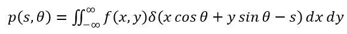

  考虑一个在y轴上，距离原点为r的一个点源，沿着不同的投射角度可以获得一个不同的投影观测值，这里要注意一个点，这个投影值仍然是线积分，不是光这一点最后的投影值，所以类似"CT的正弦图一个正弦很多会说对应的是一个像素点的所有投影值"这种说法是错误的，一个正弦其实表示的是在一个特定的角度下所有的投影值，如下图所示，对于不在y轴上的点，此时将投影线延长到焦点即可获得对应的r值：

  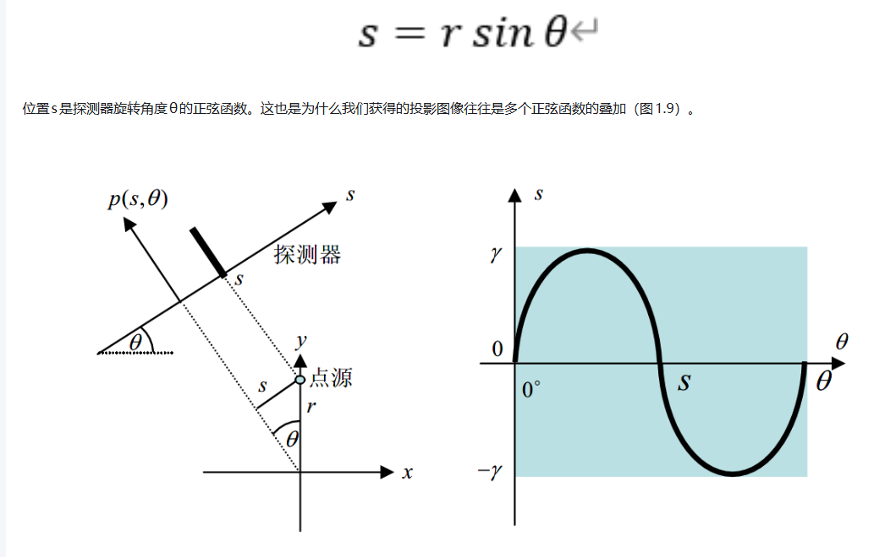

  CT重建中一个很基本的方法是中心切片定理，描述为密度函数f(x,y)的投影函数p(s)的傅里叶变换P(w)(此时针对于单个投影角度而言)等于函数f(x,y)的傅里叶变换
  $F(w_x,w_y)$沿探测器过原点的片段，按照这个思路，只要我们将投影函数在频域不断叠加，最终做一次二维逆傅里叶变换即可获得最终图像，但中心切片定理不用于重建，原因在于频域中高频的丢失会很严重：

  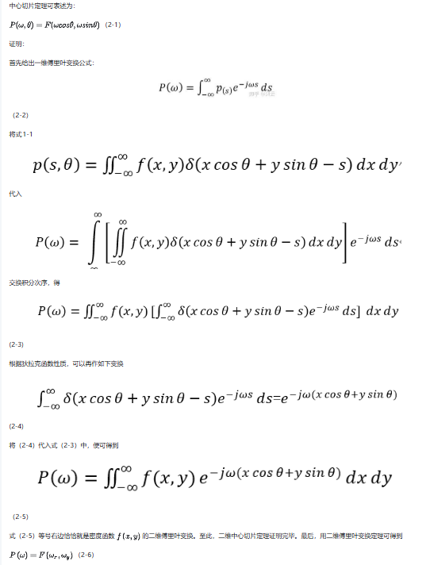

  通过分析直接反投影的方法的数学形式(本质上就是将所有反投影按照原来的方向再撒回原来的路径上的每一个像素点)，具体推导如下(这里面有几个公式有错误，看的时候还是挺明显的，可以自行区分)：

  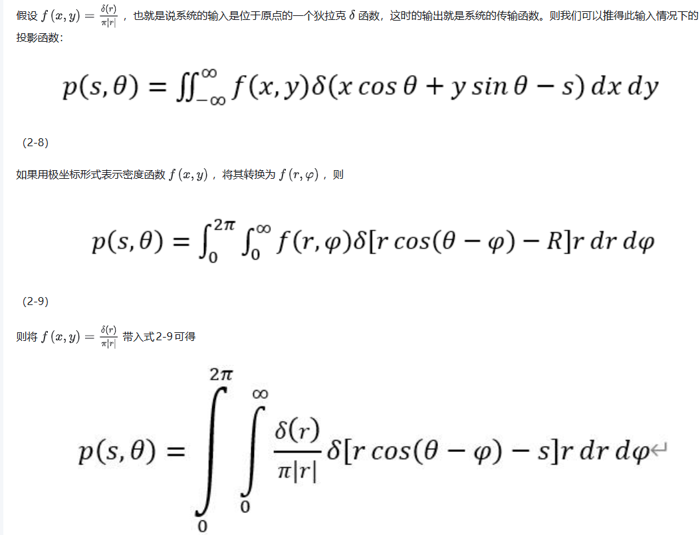
  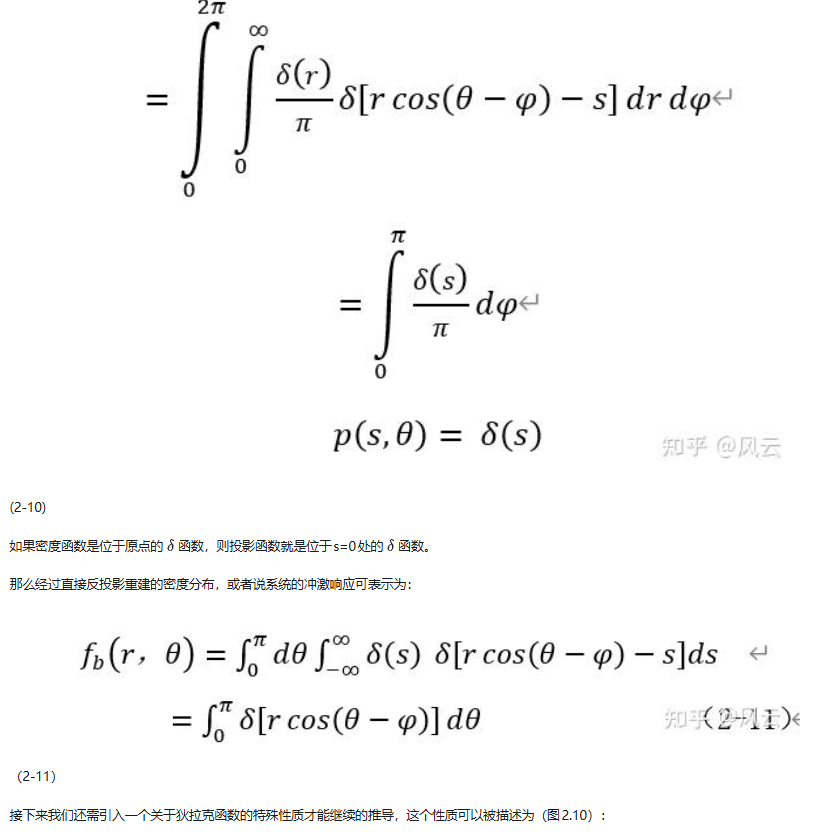
  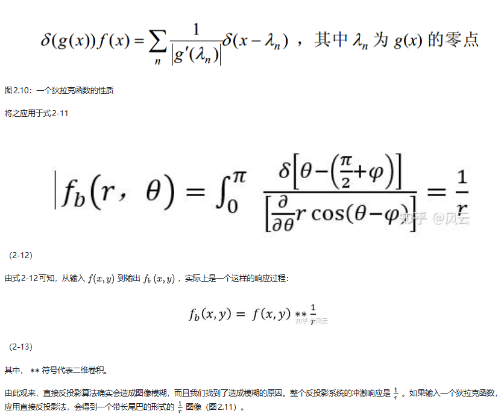

  频域可以将卷积转换为乘法操作，因此在频域这个去卷积的操作就非常简单，FBP(滤波反投影)的思路就是这样：把投影数据的一维傅里叶变换
  $P(w,\theta)$乘上
  $|w|$，再对其做一维反变换+反投影。

  有了上面的背景知识，开始这篇文章的分析，本文建立在相对静止的FFL旋转基础上，也就是说，当梯度场将FFL旋转到某个角度后，梯度场不再使FFL旋转，随之驱动场将FFL反复振荡多次，对当前角度下的FOV进行来回扫描，之后再旋转，文章中将这样的非continuous的旋转称为sequential FFL rotation，注意本文之后所有的结论都建立在这样的扫描方案之下。

  在特定的角度下，考虑坐标系之间的转换，此时坐标在新的FFL旋转角度坐标系下：

  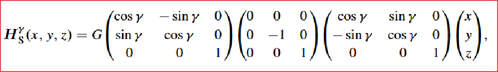

  根据上面的推导，可以得到此时的梯度场方向是垂直于FFL的(其实思考一下也能理解)，要在垂直于FFL的方向上平移FFL，所以驱动场也可以按照类似的方式表示，这样整体的磁场强度如下：

  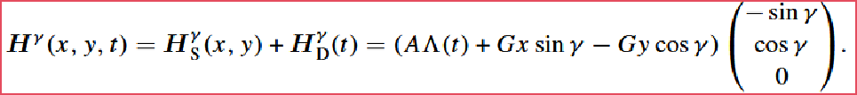

  下面一系列的推导较为连续，连续给出图片展示推导过程(第三张图中的公式就给出了MPI中拉东变换的形式，
  $\epsilon即投影距离，\gamma即投影线角度$)：

  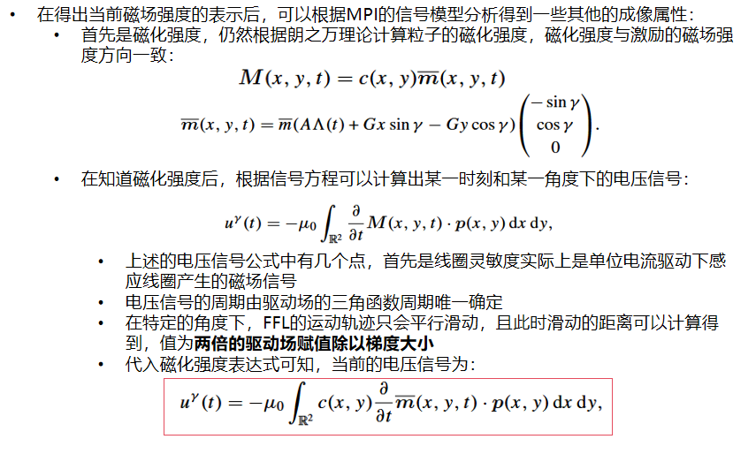
  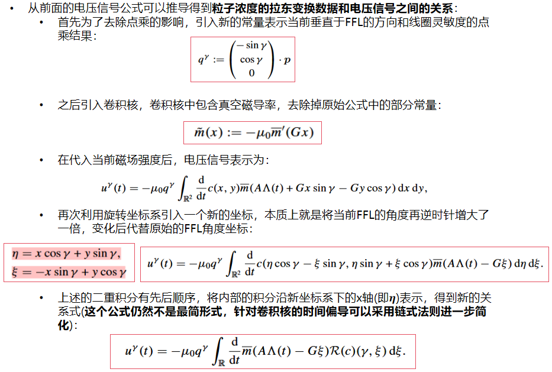
  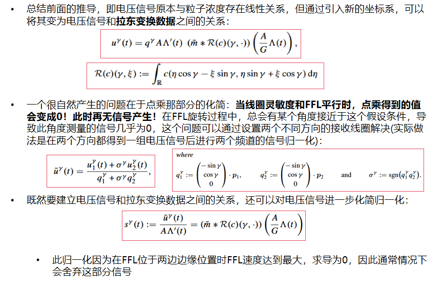
  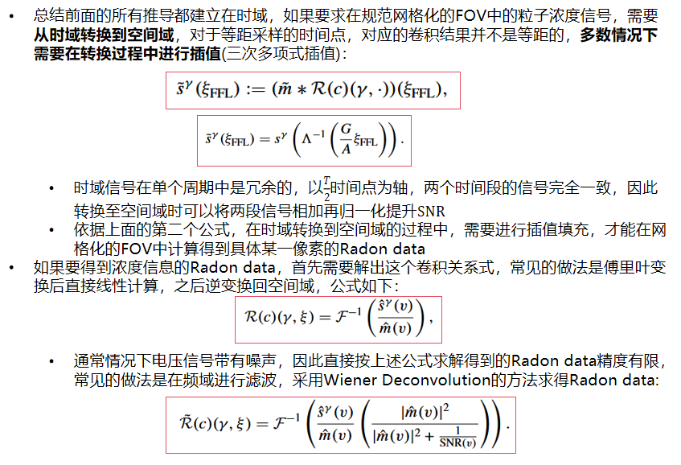

  综上所示，可以用伪代码表示如何求得每个角度的FFL扫描范围内的拉东变换数据：

  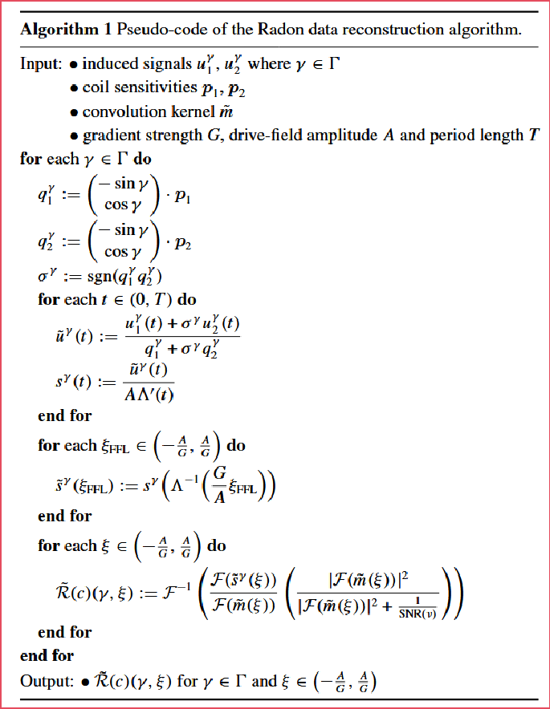

  求得拉东数据后就是CT重建的事情啦：

  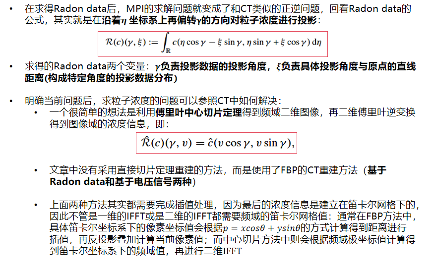

  仿真实验中给出了六种信号加以展示，分别是x方向上的信号、y方向上的信号、叠加信号、去除FFL速度的纯卷积信号、插值到空间域的信号、解卷积的拉东信号；横纵坐标是角度和时间，下图可以得到以下结论：单一信号频道下的电压信号最早只有角度和时间两个变量，因为对时间求导的链式法则计算的关系，此时周期内还没有重复信号，但能观察到单一频道下某一个角度信号完全为0；未防止信号丢失，合并两个频道的信号，此时信号在角度方向呈现出重复现象：

  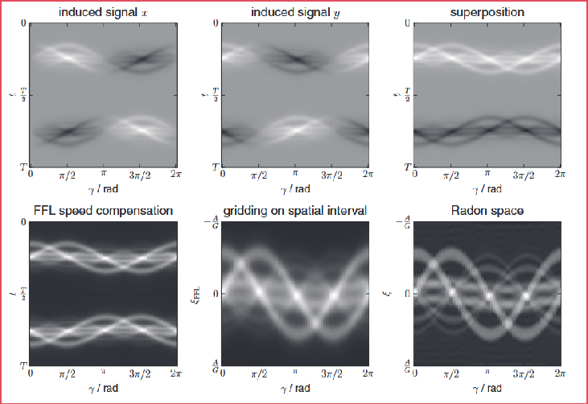

  和传统迭代的系统矩阵方法的对比就不做了，一些思考：**这篇文章的重建方法基于FFL旋转和平移分离的磁场设计，但在一些设计中这两者是同时存在的，此时其实大致的重建流程不会改变，但Radon space一定不再是直线的投影了，会变成曲线的集合；本文一个很大的问题在于并未考虑磁场信号在接收线圈中产生的电压信号，在系统矩阵重建方法中这个问题能被傅里叶变换和正则化比较好的解决，但在基于Radon data的方法中，其实需要建立起Radon data和频域过滤的电压信号之间的线性关系，这个关系式可以由一个系统矩阵表示，再使用线性迭代的方式求解，另外，这个系统矩阵会比传统的电压信号和粒子浓度之间的系统矩阵维度小很多(Radon data是角度有限的投影数据)，因此求解难度会比传统方法要小得多；很多文章会将这篇文章的观点归类在时域映射信号的范畴内，总的来说也确实如此，不管是X-Space方法还是文章中使用拉东变换重建方法，其实都是将一个时间点的信号映射到具体的一个位置的信号(X-Space是将其映射到一个点，拉东变换是将其映射到一条线)**。

  
  

  

  

  
